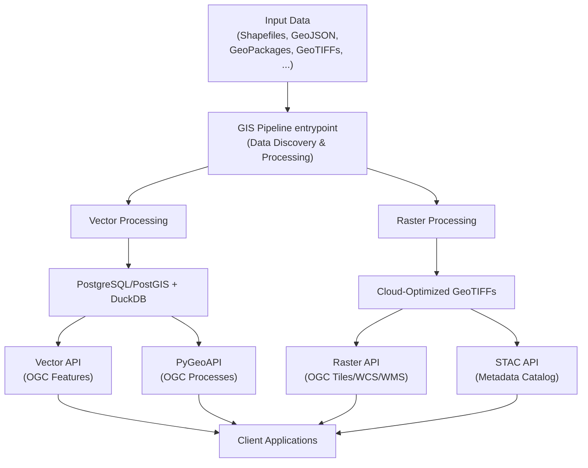

# Geospatial Data API

A comprehensive geospatial data platform that automates the processing, indexing, and publication of GIS data from multiple sources into a distributed API ecosystem using open standards (STAC, OGC API Features, OGC API Processes) and cloud-native architecture.

---

## Overview

This repository provides a complete geospatial data management solution with the following features:

- **Automated Data Pipeline**: Ingest and process diverse geospatial data formats (shapefiles, GeoJSON, GeoPackages, GeoTIFFs, CSVs)
- **Multi-API Ecosystem**: Access data through STAC, Vector API, Raster API, and PyGeoAPI endpoints
- **Standards Compliance**: Full STAC, OGC API Features, and OGC API Processes compliance
- **Analytics Integration**: DuckDB for in-process SQL analytics on Parquet/GeoParquet files
- **Cloud-Native**: Modular, containerized architecture based on proven open-source projects

---

## Table of Contents

- [Quick Start](#quick-start)
- [Architecture](#architecture)
- [Service Documentation](#service-documentation)
- [Workflows & Guides](#workflows--guides)
- [Services Documentation](#service-documentation)
- [Supported Standards](#supported-standards)
- [Troubleshooting](#troubleshooting)
- [Contributing](#contributing)
- [License & Attribution](#license--attribution)

---

## Quick Start

Get the platform running in 5 minutes:

### Prerequisites
- Docker
- Git

### 1. Clone & Configure

```bash
# Clone the repository
git clone https://github.com/Mon-Systeme-Fourrager/mos-gis.git
cd mos-gis

# Copy environment template
cp env.example .env
```

### 2. Build & Start Services

```bash
# Build and start all services
docker compose up --build
```

Wait for all services to be ready (look for "services ready" messages). This starts:
- PostgreSQL + PostGIS
- STAC API (http://localhost:8081)
- Vector API (http://localhost:8083)
- Raster API (http://localhost:8082)
- PyGeoAPI (http://localhost:5000)

### 3. Add Data & Process

```bash
# Option A: Use included sample data (recommended for first test)
cp data/demo/sample_points.geojson data/input/vector/
cp data/demo/sample_polygons.geojson data/input/vector/
cp data/demo/sample_data.csv data/input/vector/

# Option B: Add your own data
cp your_data.shp data/input/vector/
cp your_raster.tif data/input/raster/

# Run the processing pipeline
docker compose exec gis-pipeline python3 -m gis_pipeline.main

# Data is now standardized and available:
# - Vectors → PostGIS + GeoParquet
# - Rasters → COGs in data/output/raster_cog/
# - Metadata → STAC catalog
```

### 4. Verify & Explore

```bash
# Check available collections
curl http://localhost:8081/collections

# Query vector features
curl http://localhost:8083/collections

# List available processes
curl http://localhost:5000/processes?f=html
```

---

## Architecture



**Key Data Flow:**
1. **Input** → Raw geospatial data in any format
2. **Processing** → GIS Pipeline discovers, validates, and transforms data
3. **Storage** → Vectors in PostGIS, Rasters as COGs, Metadata in STAC
4. **Access** → Multiple APIs expose the data via REST/OGC standards
5. **Use** → Clients query and integrate data seamlessly

---

## Service Documentation

Each service has detailed documentation. Start with what you need:

### Data Pipeline
**Entry point for adding new data.**

**[→ GIS Pipeline README](gis-pipeline/README.md)**

### STAC API
**Browse and search raster datasets by location and time.**

**[→ STAC API README](stac-api/README.md)**

### Vector API
**Query and filter geospatial features (points, lines, polygons).**

**[→ Vector API README](vector-api/README.md)**

### Raster API
**Access raster data through OGC standards.**

**[→ Raster API README](raster-api/README.md)**

### PyGeoAPI
**Execute geospatial processes and custom algorithms.**

**[→ PyGeoAPI README](pygeoapi/README.md)**

---

## Workflows & Guides

Detailed workflows and practical guides for common tasks:

### Data Processing Workflows
- **[Tile Generation & Caching](docs/pipelines/tiles_generation_cache.md)** - Generate and cache map tiles for web applications
- **[Reading GeoParquet with Leaflet](docs/pipelines/read_geoparquet_with_leaflet.md)** - Use GeoParquet files in web mapping applications

### Data Source Documentation
- **[GRHQ Data (Quebec Soil)](docs/data/GRHQ_GRHQ-HR.md)** - High-resolution soil data for Quebec
- **[SIIGSOL Data](docs/data/siigsol.md)** - Soil information system documentation
- **[PostGIS Table Examples](docs/data/table_postgis_example.md)** - Sample PostGIS table structures
- **[STAC Metadata Example](docs/data/stac_metadata_example.txt)** - Example STAC metadata structure

### Integration Guides
- **[OpenEO Getting Started](docs/data/openEO_GettingStarted.ipynb)** - Jupyter notebook for OpenEO integration

### API Documentation
- **[API Services Overview](docs/api/QUICK_REFERENCE.md)** - Overview of all API services

---

## Data Pipeline

### Workflow Overview

The **GIS Pipeline** automates the complete data lifecycle:

```
Raw Data → Discovery → Validation → Transformation → Ingestion → Publishing
```

### Supported Formats

**Vectors:**
- Shapefiles (`.shp`)
- GeoJSON (`.geojson`, `.json`)
- GeoPackages (`.gpkg`)
- Geodatabases (`.gdb`)
- CSV files with geometry

**Rasters:**
- GeoTIFF (`.tif`, `.tiff`)
- Georeferenced imagery

**Tabular:**
- CSV files (with or without geometry)

### Processing Steps

1. **Discovery** → Recursively scan input directory, classify by type
2. **Validation** → Check CRS, geometry integrity, attribute structure
3. **Transformation** → Reproject to target CRS (default: EPSG:4326)
4. **Ingestion** → 
   - Vectors → PostGIS tables
   - Tabular → DuckDB Parquet files
5. **Publication** →
   - STAC metadata created
   - APIs automatically discover new data

## Supported Standards

### Specifications

- **[STAC 1.0.0](https://stacspec.org/)** - SpatioTemporal Asset Catalog for metadata
- **[OGC API Features](https://ogcapi.ogc.org/features/)** - Vector data access
- **[OGC API Processes](https://ogcapi.ogc.org/processes/)** - Geospatial processing
- **[OGC WCS 2.0.1](https://www.ogc.org/standards/wcs/)** - Web Coverage Service
- **[OGC WMS 1.3.0](https://www.ogc.org/standards/wms/)** - Web Map Service

### Formats

- **[COG](https://cogeo.org/)** - Cloud-Optimized GeoTIFF (rasters)
- **[GeoParquet](https://geoparquet.org/)** - Columnar geospatial data
- **[GeoJSON](https://geojson.org/)** - Vector features

---

## Troubleshooting

### Common Issues

#### Services Won't Start

**Problem:** `docker compose up` fails with error messages

**Solutions:**
```bash
# Check Docker and Docker Compose are installed
docker --version
docker compose --version

# Check port conflicts (8081, 8082, 8083, 5000 need to be free)
lsof -i :8081
lsof -i :8082
lsof -i :8083
lsof -i :5000

# Force rebuild if cache is stale
docker compose build --no-cache

# Check service logs
docker compose logs -f [service-name]
# Example: docker compose logs -f stac-api
```

**Note:** Docker performs better on Unix-based systems. On Windows, we recommend using Windows Subsystem for Linux (WSL 2) for optimal compatibility and performance.

#### Pipeline Processing Errors

**Problem:** GIS Pipeline fails with data processing errors

**Solutions:**
```bash
# Check input data location
ls -la data/input/

# Review detailed pipeline logs
docker compose logs -f gis-pipeline

# Validate data format manually
docker compose exec gis-pipeline python3 -c "
import geopandas as gpd
data = gpd.read_file('/data/input/your_file.shp')
print(data.head())
"

# Run with verbose logging
docker compose exec gis-pipeline python3 -m gis_pipeline.main --verbose
```

#### PostgreSQL Connection Issues

**Problem:** API can't connect to database

**Solutions:**
```bash
# Check PostgreSQL is running
docker compose ps postgres

# Verify database was initialized
docker compose exec postgres psql -U postgres -c "\l"

# Check network connectivity from service
docker compose exec vector-api curl http://postgres:5432

# View PostgreSQL logs
docker compose logs postgres
```

#### API Endpoints Not Responding

**Problem:** API endpoints return 404 or timeout

**Solutions:**
```bash
# Verify service is running
docker compose ps [service-name]

# Test service health
curl http://localhost:8081/health
curl http://localhost:8083/health
curl http://localhost:8003/health

# Check service logs
docker compose logs -f [service-name]

# Verify data was processed
docker compose exec postgres psql -U postgres -d gis_data -c "SELECT * FROM information_schema.tables WHERE table_schema='public';"
```

#### Data Not Appearing in API

**Problem:** Processed data isn't visible in API endpoints

**Solutions:**
```bash
# Verify pipeline completed successfully
docker compose logs gis-pipeline | tail -50

# Check output was generated
ls -la data/output/raster_cog/

# Verify STAC metadata was created
curl http://localhost:8081/collections

# Check PostGIS tables
docker compose exec postgres psql -U postgres -d gis_data -c "\dt"

# Re-run pipeline with verbose output
docker compose exec gis-pipeline python3 -m gis_pipeline.main --verbose
```

### View Logs

```bash
# All services
docker compose logs

# Specific service
docker compose logs gis-pipeline

# Follow logs in real-time
docker compose logs -f vector-api

# Last 100 lines
docker compose logs --tail 100 stac-api

# Since specific time
docker compose logs --since 2024-01-05T10:00:00 raster-api
```

### Clean & Reset

```bash
# Stop all services
docker compose down

# Remove all data (WARNING: deletes everything)
docker compose down -v

# Remove and rebuild from scratch
docker compose down -v --rmi all
docker compose build --no-cache
docker compose up --build
```

## Testing

```bash
# Run all tests
docker compose run --rm tests
```

---

## Project Planning

**Current Focus:**
- Documentation improvements
- Earth Observation data integration
- OGC API Processes expansion


## Contributing 
Please follow our comprehensive [contributing guidelines](docs/CONTRIBUTING.md)


## Technology Stack

**Core Technologies:**
- **[Python 3.11](https://github.com/python/cpython)** - Primary language
- **[Docker](https://www.docker.com/)** - Containerization
- **[PostgreSQL + PostGIS](https://github.com/postgis/postgis)** - Spatial database
- **[DuckDB](https://github.com/duckdb/duckdb)** - Analytics engine
- **[FastAPI](https://github.com/tiangolo/fastapi)** - Web framework
- **[GDAL](https://github.com/osgeo/gdal)** / **[Rasterio](https://github.com/rasterio/rasterio)** / **[Geopandas](https://github.com/geopandas/geopandas)** - Geospatial libraries
- **[eoAPI](https://github.com/developmentseed/eoAPI)** - Cloud-native framework providing modular STAC, raster, and vector APIs

**OGC Services:**
- **[pgSTAC](https://github.com/stac-utils/pgstac)** - STAC metadata management
- **[stac-fastapi](https://github.com/stac-utils/stac-fastapi)** - STAC API implementation
- **[TiTiler](https://github.com/stac-utils/titiler)** - Tile generation
- **[TiPg](https://github.com/developmentseed/tipg)** - Vector tile server
- **[PyGeoAPI](https://github.com/geopython/pygeoapi)** - OGC Processes

**Frontend:**
- **[STAC Browser](https://github.com/radiantearth/stac-browser)** - Metadata exploration
- **[VEDA UI](https://github.com/developmentseed/veda-ui)** - Data visualization (planned)
- **[Leaflet](https://leafletjs.com/)** - Web mapping library
- **[OpenEO](https://www.openeo.org/)** - Earth Observation API (planned integration)

---

## License & Attribution

This project builds on open-source projects. See the [Technology Stack](#technology-stack) section above for links and details.

For individual project licenses, refer to their respective repositories.

**Project License:** [TBD]

---

## Project Context

This backend is developed as part of a research initiative on sustainable agriculture in Quebec. The platform determines soil organic matter accumulation potential and enables informed decision-making for agricultural practices. 

More information: [RQRAD Project](https://rqrad.com/projet/developpement-dun-systeme-daide-a-la-decision-pour-determiner-le-potentiel-daccumulation-de-matiere-organique-du-sol-au-quebec-et-les-pratiques-pour-latteindre/)

---

## Support & Questions

For issues, feature requests, or questions:
- Check the [Troubleshooting](#troubleshooting) section
- Review service-specific READMEs
- Check Docker logs: `docker compose logs [service]`
- File an issue on GitHub
