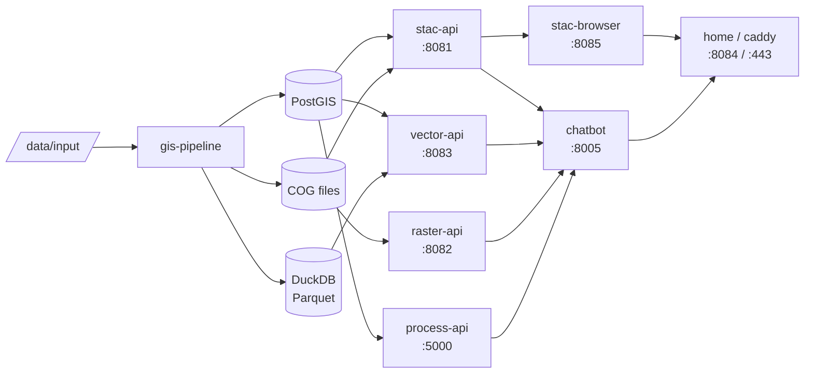

# Architecture

Agri-SDSS is a pipeline → storage → API → frontend platform for sustainable agriculture research in Quebec.

## Data flow



## Steps

1. **Input** — drop geospatial files in `data/input/`
2. **Processing** — `gis-pipeline` discovers, validates, reprojects, and ingests data
3. **Storage** — vectors → PostGIS + GeoParquet; rasters → Cloud-Optimized GeoTIFFs; metadata → pgSTAC
4. **Access** — four standards-compliant APIs expose the data
5. **Frontend** — STAC Browser, the home map page, and the AI chatbot consume the APIs
6. **Public entry** — Caddy terminates TLS and proxies all traffic to the `home` service

## Services

| Service | Port | Role |
| --- | --- | --- |
| `gis-pipeline` | — | Ingestion: geodata → PostGIS + COGs + GeoParquet + STAC |
| `stac-api` | 8081 | STAC 1.0.0 catalog (stac-fastapi + pgSTAC) |
| `vector-api` | 8083 | OGC Features — PostGIS (TiPg) and DuckDB/Parquet backends |
| `raster-api` | 8082 | OGC Tiles / WCS / WMS for COGs (TiTiler) |
| `process-api` | 5000 | OGC Processes — climate, satellite, LiDAR (PyGeoAPI + OpenEO) |
| `chatbot` | 8005 / 3001 | AI geospatial assistant (backend + React frontend) |
| `stac-browser` | 8085 | STAC catalog explorer UI (served at `/stac/` via home) |
| `home` | 8084 | Nginx reverse proxy + map page |
| `caddy` | 443 / 80 | TLS termination, HTTPS redirect, rate limiting |
| `database` (PostGIS) | 5432 | pgSTAC schema + vector feature tables |

## Technology choices

| Concern | Technology |
| --- | --- |
| Geospatial processing | GDAL, Rasterio, GeoPandas |
| Spatial database | PostgreSQL + PostGIS + pgSTAC |
| Columnar analytics | DuckDB + GeoParquet |
| STAC API | stac-fastapi-pgstac |
| Raster tiles | TiTiler |
| Vector features | TiPg |
| OGC Processes | PyGeoAPI |
| EO imagery | OpenEO / Copernicus Data Space |
| AI agent | OpenGeo-AI-Assistant (LLM-agnostic) |
| Web server / TLS | Caddy 2 |
| Map UI | Leaflet |

## Common commands

```bash
# STAC — browse collections and search items
curl http://<host>:8081/collections
curl -X POST http://<host>:8081/search \
  -H "Content-Type: application/json" \
  -d '{"collections": ["my-collection"], "limit": 10}'

# Vector API — list collections, fetch features, spatial query
curl http://<host>:8083/postgis/collections
curl http://<host>:8083/postgis/collections/{collectionId}/items?limit=10
curl "http://<host>:8083/postgis/collections/{collectionId}/items?bbox=-71.5,45.0,-71.0,45.5"

# Raster API — COG metadata and tiles (TiTiler)
curl "http://<host>:8082/cog/info?url=<COG_URL>"
curl "http://<host>:8082/cog/tiles/{z}/{x}/{y}.png?url=<COG_URL>"

# OGC Processes — list and inspect processes
curl http://<host>:5000/processes
curl http://<host>:5000/processes/{processId}
```

Error messages are returned in **French by default**. To get English, send an `Accept-Language`
header or a `lang` query parameter:

```bash
curl -H "Accept-Language: en" .../vector-api/som-field-match
curl '.../processes/msc-observations?f=json&lang=en'
```

See [Internationalization](I18N.md) for the full language contract.
