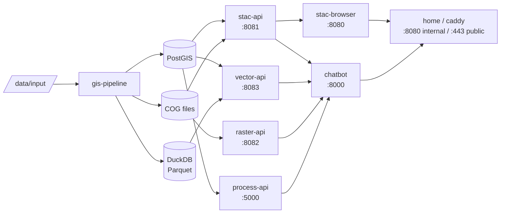

# Architecture

Agri-SDSS is a pipeline → storage → API → frontend platform for sustainable agriculture research in Quebec.

## Data flow



## Steps

1. **Input** — drop geospatial files in `data/input/`
2. **Processing** — `gis-pipeline` discovers, validates, reprojects, and ingests data
3. **Storage** — vectors → PostGIS + GeoParquet; rasters → Cloud-Optimized GeoTIFFs; metadata → pgSTAC
4. **Access** — four standards-compliant APIs expose the data
5. **Frontend** — STAC Browser, the home map page, and the AI chatbot consume the APIs
6. **Public entry** — Caddy terminates TLS and proxies all traffic to the `home` service

## Services

| Service | Internal port | Role |
| --- | --- | --- |
| `gis-pipeline` | — | Ingestion: geodata → PostGIS + COGs + GeoParquet + STAC |
| `stac-api` | 8081 | STAC 1.0.0 catalog (stac-fastapi + pgSTAC) |
| `vector-api` | 8083 | OGC Features — PostGIS (TiPg) and DuckDB/Parquet backends |
| `raster-api` | 8082 | OGC Tiles / WCS / WMS for COGs (TiTiler) |
| `process-api` | 5000 | OGC Processes — climate, satellite, LiDAR (PyGeoAPI + OpenEO) |
| `chatbot` | 8000 / 3001 | AI geospatial assistant (backend + React frontend) |
| `stac-browser` | 8080 | STAC catalog explorer UI (served at `/stac/` via home) |
| `home` | 8080 | Nginx reverse proxy + map page (also serves `/cog/<file>.tif` — static COG downloads from `./data/output/raster_cog`, the hrefs published in STAC asset metadata) |
| `caddy` | 443 / 80 | TLS termination, HTTPS redirect, rate limiting |
| `database` (PostGIS) | 5432 | pgSTAC schema + vector feature tables |

These are **container-internal** ports (`expose:`), reachable only from within the
Docker network. Only `caddy` (`80`/`443`) and `database`
(`127.0.0.1:5439`, loopback only) are published to the host; every other service is
reached through Caddy at the public origin, never at `http://<host>:<port>`.

### STAC asset hrefs

A STAC asset href must be absolute and publicly resolvable, so every publisher
builds them from `HOST_PROTOCOL://HOST_URL` rather than from the container-local
path it wrote the file to. Each published raster carries three assets:

| Asset | Route | What it is |
| --- | --- | --- |
| the product itself (`dtm`, `ndvi`, `data`, …) | `/cog/<file>.tif` | The COG, served statically by `home` with byte-range support — what GDAL `/vsicurl`, rasterio and QGIS open |
| `preview` / `<product>_preview` | `/raster-api/cog/preview.png` | A PNG rendered on demand by TiTiler; no download |
| `tilejson` / `<product>_tilejson` | `/raster-api/cog/WebMercatorQuad/tilejson.json` | XYZ tile endpoints for dynamic map display |

A Sentinel-2 item holds several products, so its render assets are keyed per
product; LiDAR and pipeline items hold one raster and use the bare keys.

The render hrefs carry the query parameters TiTiler needs to produce a
meaningful image: `bidx` when the COG has a band count TiTiler cannot encode
whole (a 6-band soil COG answers 500 without it), and `rescale` with the band's
own value range, without which a float band is cast straight to uint8 and
renders flat.

## Technology choices

| Concern | Technology |
| --- | --- |
| Geospatial processing | GDAL, Rasterio, GeoPandas |
| Spatial database | PostgreSQL + PostGIS + pgSTAC |
| Columnar analytics | DuckDB + GeoParquet |
| STAC API | stac-fastapi-pgstac |
| Raster tiles | TiTiler |
| Vector features | TiPg |
| OGC Processes | PyGeoAPI |
| EO imagery | OpenEO / Copernicus Data Space |
| AI agent | OpenGeo-AI-Assistant (LLM-agnostic) |
| Web server / TLS | Caddy 2 |
| Map UI | Leaflet |

## Common commands

All services are reached through the single public origin — Caddy routes each path
prefix to the right backend. Against a local deployment, add `-k` (`curl -k
https://localhost/...`) because the certificate is self-signed.

```bash
# STAC — browse collections and search items
curl https://<host>/stac-api/collections
curl -X POST https://<host>/stac-api/search \
  -H "Content-Type: application/json" \
  -d '{"collections": ["my-collection"], "limit": 10}'

# Vector API — list collections, fetch features, spatial query
curl https://<host>/vector-api/postgis/collections
curl https://<host>/vector-api/postgis/collections/{collectionId}/items?limit=10
curl "https://<host>/vector-api/postgis/collections/{collectionId}/items?bbox=-71.5,45.0,-71.0,45.5"

# Raster API — COG metadata and tiles (TiTiler)
curl "https://<host>/raster-api/cog/info?url=<COG_URL>"
curl "https://<host>/raster-api/cog/tiles/{tileMatrixSetId}/{z}/{x}/{y}.png?url=<COG_URL>&bidx=1"

# OGC Processes — list and inspect processes
curl https://<host>/process-api/processes
curl https://<host>/process-api/processes/{processId}
```

Error messages are returned in **French by default**. To get English, send an `Accept-Language`
header or a `lang` query parameter:

```bash
curl -H "Accept-Language: en" .../vector-api/som-field-match
curl '.../processes/msc-observations?f=json&lang=en'
```

See [Internationalization](I18N.md) for the full language contract.
