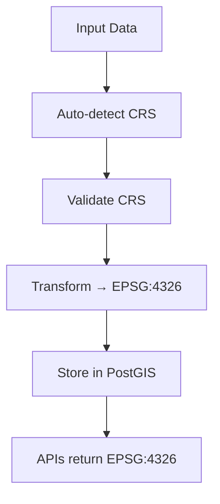

# CRS Management & Coordinate System Transformation

Guide to handling coordinate reference systems (CRS).

## Overview

Coordinate Reference Systems (CRS) define how geographic coordinates map to the Earth's surface. Different datasets may use different CRS, we must harmonize them for consistent analysis.

> **Default CRS:** EPSG:4326 (WGS84 - latitude/longitude)

## Understanding CRS

### What is a CRS?

A CRS specifies:

- **Datum**: Reference surface (spheroid) representing the Earth
- **Projection**: Mathematical transformation from 3D sphere to 2D plane
- **Units**: Typically degrees (geographic) or meters (projected)

### CRS Types

| Type | Definition | Example | Use Case |
| ------ | ----------- | --------- | ---------- |
| **Geographic** | Uses lat/long on sphere | EPSG:4326 (WGS84) | Global, web APIs |
| **Projected** | Transformed to flat plane | EPSG:32198 (UTM 18N) | Distance calculations |
| **Local** | Regional custom projection | Various | Specialized survey work |

### Common Quebec CRS

| Code | Name | Type | Region | Accuracy |
| ------ | ------ | ------ | -------- | ---------- |
| **4326** | WGS84 (lat/lon) | Geographic | Global | ±5m (web) |
| **32198** | NAD83 / UTM Zone 18N | Projected | Quebec | ±1m (ground distances) |
| **4617** | NAD83 (geographic) | Geographic | North America | Older system |

## CRS

### Default Behavior

The gis-pipeline automatically:

1. **Detects** CRS in input data
2. **Validates** CRS is known/supported
3. **Transforms** to EPSG:4326 (WGS84)
4. **Stores** in PostGIS with EPSG:4326
5. **Returns** in EPSG:4326 via APIs



### Configuration

Edit `gis-pipeline/config.yaml`:

```yaml
pipeline:
  GLOBAL_CRS: 4326 # Target CRS for all data
  PROJ_LIB: /usr/share/proj # Projections directory
```

## Coordinate Transformations

### Automatic Transformation (Python - GeoPandas)

```python
import geopandas as gpd

# Load data (any CRS)
gdf = gpd.read_file('data.shp')
print(f"Original CRS: {gdf.crs}")

# Transform to EPSG:4326
gdf = gdf.to_crs(4326)
print(f"New CRS: {gdf.crs}")

# Verify
assert gdf.crs.to_epsg() == 4326
```

### Using GDAL/OGR

```bash
# Vector data
ogr2ogr -t_srs EPSG:4326 output.shp input.shp

# Raster data
gdalwarp -t_srs EPSG:4326 input.tif output_4326.tif
```

### Using PostGIS SQL

```sql
-- Transform geometry to EPSG:4326
SELECT id, ST_Transform(geom, 4326) as geom
FROM features
WHERE ST_SRID(geom) = 32198;

-- Create transformed table
CREATE TABLE features_4326 AS
SELECT id, ST_Transform(geom, 4326) as geom
FROM features
WHERE ST_SRID(geom) = 32198;

-- Verify CRS
SELECT ST_SRID(geom), COUNT(*) 
FROM features_4326 
GROUP BY ST_SRID(geom);
```

## Common CRS Transformations

### Quick Reference Table

| From | To | Command | Notes |
| ------ | ----- | --------- | ------- |
| UTM 18N (32198) | WGS84 (4326) | `to_crs(4326)` | Most common |
| NAD83 (4617) | WGS84 (4326) | `to_crs(4326)` | Legacy system |
| Web Mercator (3857) | WGS84 (4326) | `to_crs(4326)` | From web maps |
| WGS84 (4326) | UTM 18N (32198) | `to_crs(32198)` | For precise distances |

## Troubleshooting CRS Issues

### Issue 1: "Invalid CRS" Error

```python
# Symptom
import geopandas as gpd
gdf = gpd.read_file('data.shp')
# Error: Cannot determine CRS

# Solution 1: Specify CRS explicitly
gdf = gpd.read_file('data.shp')
gdf.crs = 'EPSG:32198'
gdf = gdf.to_crs(4326)

# Solution 2: Check .prj file
with open('data.prj', 'r') as f:
    print(f.read())  # Shows CRS definition
```

### Issue 2: Coordinates Appear Offset

```sql
-- Symptom: Features appear in wrong location on map

-- Check current CRS
SELECT ST_SRID(geom), COUNT(*) FROM features GROUP BY ST_SRID(geom);

-- Solution: Transform to correct CRS
UPDATE features 
SET geom = ST_Transform(geom, 4326)
WHERE ST_SRID(geom) != 4326;
```

### Issue 3: Distance Calculations Seem Wrong

```python
# Symptom: Distance in degrees instead of meters
import geopandas as gpd

gdf = gpd.read_file('data.shp')  # In WGS84 (degrees)

# Wrong: Gets distance in degrees (≈0.01)
distance_deg = gdf.geometry[0].distance(gdf.geometry[1])

# Correct: Convert to projected CRS first
gdf_utm = gdf.to_crs(32198)
distance_m = gdf_utm.geometry[0].distance(gdf_utm.geometry[1])
```

## Advanced: Working with Non-Standard CRS

### When You Need UTM Output

Some analysis requires projected coordinates. Create alternative storage:

```sql
-- Primary table in WGS84
CREATE TABLE features_4326 (
  id SERIAL PRIMARY KEY,
  geom GEOMETRY(Geometry, 4326),
  ...
);

-- Materialized view in UTM
CREATE MATERIALIZED VIEW features_utm AS
SELECT 
  id,
  ST_Transform(geom, 32198) as geom,
  ...
FROM features_4326;

CREATE INDEX idx_features_utm ON features_utm USING GIST(geom);
```

### Handling Mixed-CRS Datasets

```python
# Some features in UTM, some in WGS84
import geopandas as gpd

gdf = gpd.read_file('mixed_data.shp')

# Identify different CRS
crs_counts = gdf.groupby(lambda x: gdf.crs).size()

# Normalize to single CRS
if gdf.crs.to_epsg() != 4326:
    gdf = gdf.to_crs(4326)

# Verify all features have same CRS
assert gdf.crs.to_epsg() == 4326
```

## Best Practices

### 1. Always Store Primary Data in WGS84

- Enables web API publishing
- Supports STAC standard
- Reduces transformation overhead

### 2. Validate CRS Before Processing

```python
assert gdf.crs is not None, "Missing CRS"
assert gdf.crs.to_epsg() in [4326, 4617, 32198], "Unsupported CRS"
```

### 3. Use Projected CRS for Measurements

```python
# Distances/areas
gdf_utm = gdf.to_crs(32198)
area_m2 = gdf_utm.geometry.area  # In square meters
```

### 4. Document Original CRS

```sql
-- Store original CRS in metadata
ALTER TABLE features ADD COLUMN original_crs VARCHAR(20);
UPDATE features SET original_crs = '32198' WHERE ST_SRID(geom) = 4326;
```

### 5. Test Transformations

```python
# Verify round-trip transformation
gdf_4326 = gpd.read_file('data.shp')
gdf_utm = gdf_4326.to_crs(32198)
gdf_back = gdf_utm.to_crs(4326)

# Coordinates should be nearly identical (within floating point error)
assert (gdf_4326.geometry.bounds - gdf_back.geometry.bounds).abs().max() < 1e-6
```

## References

- [EPSG Geodetic Parameter Dataset](https://epsg.io/)
- [PostGIS CRS Documentation](https://postgis.net/docs/ST_Transform.html)
- [PyProj Library](https://pyproj4.github.io/pyproj/stable/)
- [Rasterio CRS Guide](https://rasterio.readthedocs.io/en/latest/api/rasterio.crs.html)
- [GDAL OGR Transformations](https://gdal.org/programs/ogr2ogr.html)

## Quick Links

- [EPSG:4326 (WGS84)](https://epsg.io/4326)
- [EPSG:32198 (NAD83 UTM 18N)](https://epsg.io/32198)
- [EPSG:4617 (NAD83 geographic)](https://epsg.io/4617)
