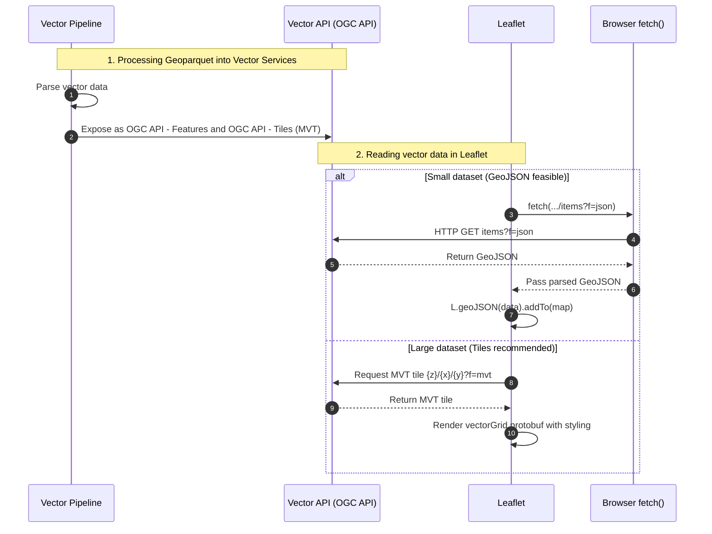

# Read GeoParquet with Leaflet
Leaflet does not natively support reading of GeoParquet. That's why we need to create a workflow for this task.
Here is the workflow using [OGC API standards](https://ogcapi.ogc.org/).

