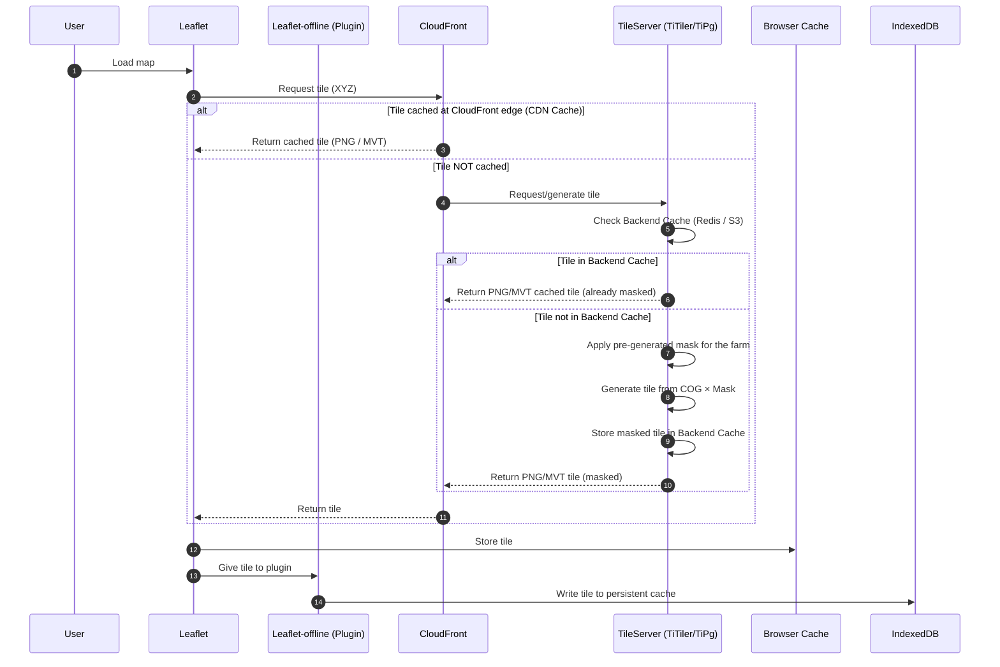
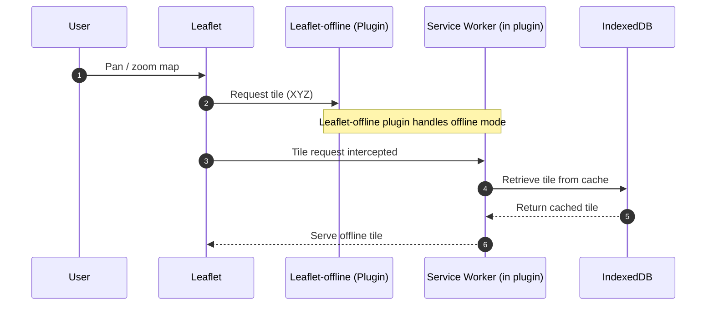

# XYZ Tiles generation and visualization in Leaflet and Leaflet-offline

Here is the workflow logic to cache XYZ Tiles in Leaflet and Leaflet-offline.
There is also a summary of all the cache level available in infrastructure and a summary of tile generation

## Online

## Offline

## Cache Level

| Cache Level          | Location                  | What It Stores                            | Main Purpose                                          | Retention Duration         |
| -------------------- | ------------------------- | ----------------------------------------- | ----------------------------------------------------- | -------------------------- |
| **1. Backend Cache** | Redis or S3 (server side) | Tiles already generated by the TileServer | Prevent recalculating tiles on the server             | Long (hours to days)       |
| **2. CDN Cache**     | CloudFront (edge servers) | Tiles received from the backend           | Serve tiles from a geographically close edge location | Medium (minutes to hours)  |
| **3. Client Cache**  | Browser Cache + IndexedDB | Tiles downloaded by Leaflet / plugin      | Speed up rendering + support offline mode             | Very long (days to months) |

## Tiles generation

The system generates raster tiles filtered to a single farm, but vector boundaries remain separate.
Each farm has its own tile endpoint, but tiles are generated efficiently using precomputed masks (not one full dataset per farm).

1. Store farm boundaries (run once)

- Each farm's boundaries are stored in PostGIS or GeoParquet.
- These boundaries are linked to a farm ID.

1. Pre-generate raster masks (run once)

- For each farm, a binary raster mask is created once at the resolution of the STAC assets.
- Masks are stored as COGs, ready to filter raster data per farm. (~MBs per farm)

1. Tile requests are farm-specific (run when requested)

- Each request URL includes the farm ID: /tiles/{farm_id}/{z}/{x}/{y}.png
- The backend TileServer reads the mask for that farm and applies it to the raster tile.
- The resulting tile only contains data for the farmer’s parcel.

1. Tile visualisation in frontend

- Vector boundaries overlay the masked raster.
