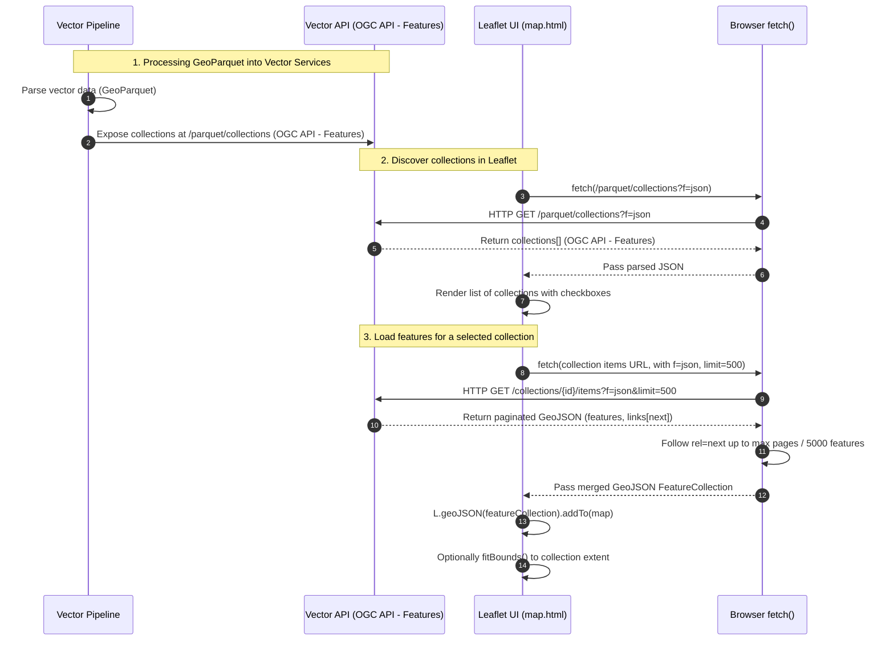

# Read GeoParquet with Leaflet
Leaflet does not natively support reading of GeoParquet. That's why we need to create a workflow for this task.
Here is the workflow using [OGC API standards](https://ogcapi.ogc.org/), aligned with the current frontend logic in `frontend/home/html/map.html`.

In this implementation:

- Leaflet uses **Vector API collections endpoint** (`/vector-api/parquet/collections` via the nginx proxy) configured in the UI as "Vector API collections endpoint".
- When the user clicks "Charger", the frontend:
  - Fetches the list of collections from the Vector API.
  - Builds the "items" URL for each collection (from its links or `/collections/{id}/items`).
  - Paginates over `rel="next"` links with `limit=500` until either there is no next page or a hard cap of 5000 features is reached.
  - Renders the merged GeoJSON using `L.geoJSON`, with simple styling and circle markers for points.
- The user can toggle visibility and zoom to a collection from the side panel; the map fits to the layer bounds when requested.

Support for vector tiles (MVT via OGC API - Tiles) is part of the overall architecture, but the current `map.html` frontend only uses the **GeoJSON /items path** of OGC API - Features to read GeoParquet-derived data.
