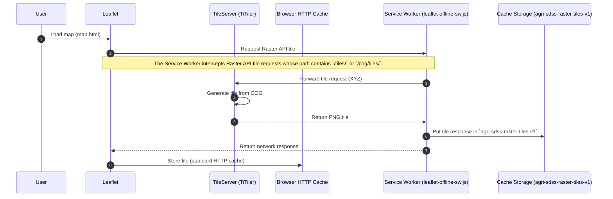
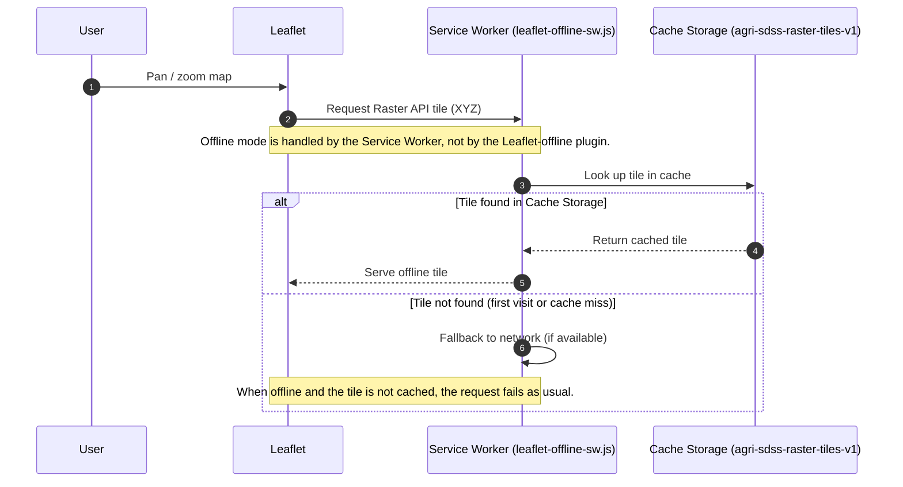

# XYZ Tiles generation and visualization in Leaflet with a Service Worker
Here is the workflow logic to cache XYZ Tiles in Leaflet using the dedicated Service Worker `leaflet-offline-sw.js`.
There is also a summary of all the cache level available in infrastructure and a summary of tile generation

## Online

## Offline

## Cache Level

| Cache Level      | Location                                | What It Stores                               | Main Purpose                                                    | Retention Duration         |
| ---------------- | --------------------------------------- | -------------------------------------------- | --------------------------------------------------------------- | -------------------------- |
| **Client Cache** | Browser HTTP Cache + Cache Storage (SW) | Tiles downloaded by Leaflet / Service Worker | Speed up rendering + support offline mode for Raster API tiles  | Very long (days to months) |

## Tiles generation
The system generates raster tiles filtered to a single farm, but vector boundaries remain separate.
In practice, farm tiles are exposed via the Raster API as dataset-specific XYZ endpoints, but tiles are generated efficiently using precomputed masks (not one full dataset per farm).

1. Store farm boundaries (run once)
- Each farm's boundaries are stored in PostGIS or GeoParquet.
- These boundaries are linked to a farm ID.

2. Pre-generate raster masks (run once) 
- For each farm, a binary raster mask is created once at the resolution of the STAC assets.
- Masks are stored as COGs, ready to filter raster data per farm. (~MBs per farm)

3. Tile requests are farm-specific (run when requested)
- Each request URL includes a farm-specific dataset identifier, typically following the Raster API pattern `/tiles/{dataset}/{z}/{x}/{y}.png` or an equivalent COG-based endpoint such as `/cog/tiles/WebMercatorQuad/{z}/{x}/{y}.png?url=...`.
- The backend TileServer reads the mask for that farm and applies it to the raster tile.
- The resulting tile only contains data for the farmer’s parcel.

4. Tile visualisation in frontend
- Vector boundaries overlay the masked raster.
