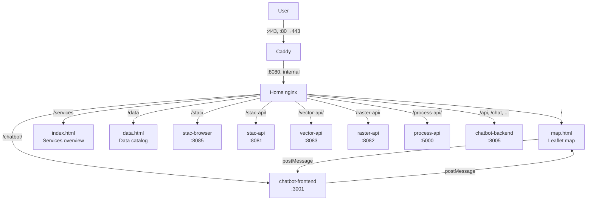

# Home Frontend

The unified entry point for Agri-SDSS. A static nginx frontend that serves the Leaflet map, proxies all sub-applications (STAC Browser, AI Chatbot) under a single origin, and bridges API traffic to backend services.

---

## Overview

**Home** is the single URL users visit. It provides:

- **Interactive map**: Leaflet-based map with vector parcels, raster overlays, SOM analysis, and STAC item visualization
- **Unified navigation**: A shared nav bar injected into every sub-application (STAC Browser, Chatbot) via nginx `sub_filter`
- **Reverse proxy**: Routes `/stac/`, `/chatbot/`, `/stac-api/`, `/vector-api/`, `/raster-api/`, `/process-api/` to the appropriate services — no CORS issues for the browser
- **COG downloads**: `/cog/<file>.tif` serves the raster files referenced by STAC asset hrefs directly as static files, with byte-range support
- **Chatbot bridge**: `chatbot-bridge.js` injected into the chatbot iframe to relay map context and tile commands between the chatbot and the Leaflet map via `postMessage`
- **Bilingual interface**: EN / FR language toggle across all pages

**Key Features:**

- Single-origin access to all Agri-SDSS services
- Vanilla JS ES modules — no build step required
- Service Worker (`leaflet-offline-sw.js`) for offline raster tile caching
- Entrypoint script patches nginx config at container startup from environment variables

---

## Architecture



**Request flow:**

1. **User opens** `https://<host>` (Caddy, the public entry point on :443) → proxied to `home:8080` → nginx serves `map.html`
2. **Map loads** → fetches vector collections from `/vector-api/`, STAC items from `/stac-api/`, tiles from `/raster-api/`
3. **User navigates to `/stac/`** → nginx proxies to stac-browser and injects the shared nav bar
4. **User opens `/chatbot/`** → nginx proxies to chatbot frontend and injects both `chatbot-bridge.js` and the nav bar
5. **Chatbot bridge** relays `AGRI_SDSS_CONTEXT` (parcel click), `AGRI_SDSS_ZOOM`, and `AGRI_SDSS_TILES` messages between the chatbot and the Leaflet map

---

## Quick Start

```bash
# Start the full stack (recommended)
docker compose up -d

# Home frontend only (requires backend services to be reachable)
docker compose up -d home
```

`home` publishes no host port — it is reachable only via Caddy (`expose: "8080"` in
`docker-compose.yml`, no `ports:` mapping). This is deliberate: Caddy carries the
rate-limit zones and security headers, and is the intended single entry point.
There is no `HOME_PORT` variable to change this.

Once running, access (through Caddy):

- **Map**: `https://<host>`
- **Services**: `https://<host>/services`
- **Data catalog**: `https://<host>/data`
- **STAC Browser**: `https://<host>/stac/`
- **AI Assistant**: `https://<host>/chatbot/`

For debugging, reach `home` directly from inside `eoapi-network`, bypassing Caddy:

```bash
docker run --rm --network eoapi-network curlimages/curl:latest -sI http://home:8080/
```

---

## Configuration

The nginx config is generated at container startup by `scripts/entrypoint.sh`. Backend service ports are patched in at runtime from environment variables.

**Environment Variables:**

```bash
STAC_BROWSER_PORT=8085       # stac-browser container port
STAC_API_PORT=8081           # stac-api container port
RASTER_API_PORT=8082         # raster-api container port
VECTOR_API_PORT=8083         # vector-api container port
PROCESS_API_PORT=5000       # process-api container port
CHATBOT_BACKEND_PORT=8005    # chatbot-backend container port
```

These are all container-internal ports used to build the proxy targets in the
generated nginx config — none of them is a host-side port for `home` itself.
`home` has no `HOME_PORT`; see [Quick Start](#quick-start) for how it is
actually reached.

### Customization

To change a proxy route or add a new one:

1. Edit `scripts/entrypoint.sh` — the nginx config is generated there as a heredoc
2. Rebuild the container: `docker compose up home --build`

---

## Features

### Leaflet Map (`map.html`)

The main page. Modules loaded via ES imports from `html/js/`:

| Module | Role |
| -------- | ------ |
| `app.js` | Entry point — wires map events, basemap switcher, nav buttons |
| `state.js` | Shared Leaflet map instance and layer registry |
| `vector.js` | BDPPAD parcel collections from `/vector-api/parquet/collections` |
| `som.js` + `som_layers.js` | SOM analysis panel and boundary layers |
| `aac.js` | Agriculture Canada crop layer (proxied via `/aac-identify/`) |
| `grhq.js` | GRHQ hydrological network layer |
| `catalog.js` | Legacy catalog modal (dead code — nothing imports it) |
| `data-catalog.js` | `/data` page: renders `catalog.json` (curated metadata) joined with live API collection lists |
| `chat.js` | Chat panel toggle |
| `chatbot-bridge.js` | postMessage relay between chatbot iframe and Leaflet map |
| `nav-inject.js` | Shared nav bar injected into STAC Browser and Chatbot |

### Unified Navigation

`nav-inject.js` is served at `/sdss-nav.js` and injected into every sub-application via nginx `sub_filter`:

- Injected into STAC Browser HTML (`<body>`)
- Injected into Chatbot HTML (`<body>`)
- Provides EN/FR language toggle and links to all pages

### Chatbot ↔ Map Bridge

`chatbot-bridge.js` is injected into the chatbot iframe via `sub_filter`. It:

- Listens for `AGRI_SDSS_CONTEXT` postMessages (sent when the user clicks a parcel on the map)
- Enriches the context with live parcel data and STAC collections, then injects an analysis prompt into the chatbot
- Intercepts Axios responses from the chatbot backend and forwards map commands to the parent map:
  - `AGRI_SDSS_ZOOM` — zooms the Leaflet map to a bbox or lat/lon
  - `AGRI_SDSS_TILES` — adds a raster tile layer to the Leaflet map

---

## Proxy Routes

| Path | Proxied To | Notes |
| ------ | ----------- | ------- |
| `/stac/` | `stac-browser:8085` | `sub_filter` rewrites asset paths and injects nav |
| `/chatbot/` | `chatbot-frontend:3001` | `sub_filter` injects chatbot-bridge.js and nav |
| `/api/`, `/chat/`, `/query/`, etc. | `chatbot-backend:8000` | Chatbot SPA uses `window.location.origin` as base URL |
| `/sdss/` | `chatbot-backend:8000` | SDSS spatial process routes |
| `/stac-api/` | `stac-api` | Used by chatbot-bridge.js |
| `/vector-api/` | `vector-api` | Used by chatbot-bridge.js and map |
| `/raster-api/` | `raster-api` | Used for tile overlays |
| `/process-api/` | `process-api:5000` | 630s read timeout for long-running processes |
| `/aac-identify/` | `agriculture.canada.ca` | CORS proxy for AAC imagery service |
| `/cog/<file>.tif` | static file, `./data/output/raster_cog` | STAC asset hrefs published by process-api and gis-pipeline. Raster extensions only (`.tif`/`.tiff`) — the same directory holds `*.stac.json` publish markers, which the regex excludes. Byte-range capable (native nginx `Range` handling, so GDAL `/vsicurl` reads only the tiles it needs); `Cache-Control: public, max-age=0, must-revalidate` |

---

## Development

### Editing Static Files

The HTML, CSS, and JS files in `html/` are served directly by nginx — no build step. Edit and rebuild:

```bash
docker compose up home --build
```

### Editing the Nginx Config

The nginx server block is generated by `scripts/entrypoint.sh` using a heredoc. Edit the heredoc, then rebuild.

---

## Troubleshooting

### Sub-application not loading

```bash
# Check that the target service is running
docker compose ps

# Check home nginx logs
docker compose logs home

# Verify proxy config was generated correctly
docker compose exec home cat /etc/nginx/conf.d/default.conf
```

### Nav bar not appearing in STAC Browser or Chatbot

```bash
# Verify sub_filter is working — check that nav injection is in the served HTML
curl -s https://<host>/stac/ | grep sdss-nav.js
```

### Chatbot bridge not relaying map commands

Open the browser console on the map page (`https://<host>`) and check for `postMessage` events. Confirm `chatbot-bridge.js` is loaded inside the chatbot iframe:

```bash
curl -s https://<host>/chatbot/ | grep chatbot-bridge.js
```

### Environment variable not applied

The entrypoint patches ports at startup — a rebuild is not needed, but the container must be restarted:

```bash
docker compose up -d home
```

---

## Technology Stack

- **[nginx:alpine](https://hub.docker.com/_/nginx)** — Web server and reverse proxy
- **[Leaflet](https://leafletjs.com/)** — Interactive map
- **Vanilla JS (ES modules)** — No framework, no build step
- **[Docker](https://www.docker.com/)** — Containerization
