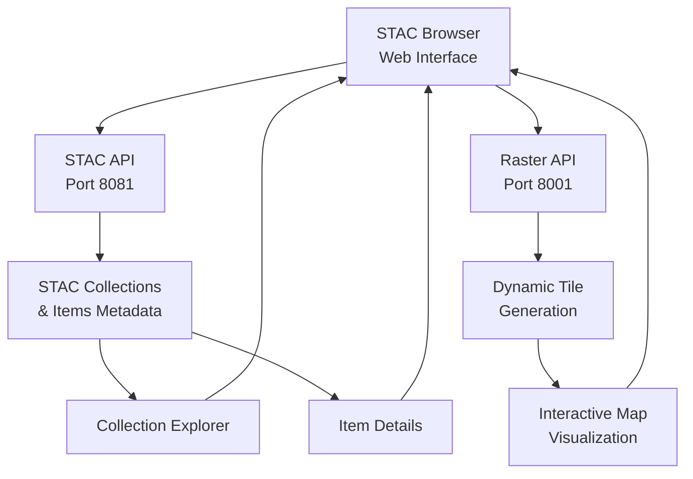

# STAC Browser

A web-based user interface for browsing and exploring STAC (SpatioTemporal Asset Catalog) collections and items through an intuitive, interactive map-based interface.

---

## Overview

**STAC Browser** provides a visual interface for discovering and exploring geospatial datasets cataloged in the STAC API. It offers:
- **Interactive browsing**: Navigate STAC collections and items through a map interface
- **Visual preview**: View thumbnails and raster previews of imagery
- **Metadata exploration**: Browse detailed item properties and asset information
- **Direct asset access**: Download or view assets directly from the browser
- **Multi-language support**: Interface available in multiple languages (EN, FR, ES, DE, IT, RO)
- **Tile-based visualization**: Automatic rendering of COG assets on interactive maps

**Key Features:**
- Responsive web interface
- Interactive map visualization
- STAC specification compliant
- Seamless integration with STAC API and Raster API
- Configurable styling and branding
- No server-side processing required (static frontend)

---

## Architecture



**Data Flow:**
1. **Browser loads** → Fetches catalog from STAC API
2. **User navigates** → Retrieves collection and item metadata
3. **Map visualization** → Requests tiles from Raster API for COGs
4. **Asset access** → Direct download or preview of assets

---

## Quick Start

### Running STAC Browser

```bash
# Navigate to repository root
cd /path/to/mos-gis

# Start the full stack (includes STAC Browser, STAC API, and Raster API)
docker compose up --build
```

```bash
# STAC Browser only (requires STAC API to be running)
docker compose up stac-browser --build
```

Once running, access:
- **STAC Browser**: http://localhost:8085 (default port)
- **Connected STAC API**: http://localhost:8081
- **Connected Raster API**: http://localhost:8082

---

## Configuration

STAC Browser is configured through `config/browser_config.js` and environment variables.

### Key Configuration Options

**In `config/browser_config.js`:**

```javascript
module.exports = {
    catalogUrl: "http://localhost:8081/",        // STAC API endpoint
    catalogTitle: "eoAPI STAC Browser",          // Browser title
    locale: "en",                                 // Default language
    supportedLocales: ["de", "es", "en", "fr", "it", "ro"],
    itemsPerPage: 12,                            // Items per page
    maxPreviewsOnMap: 50,                        // Max map previews
    buildTileUrlTemplate: ({ href, asset }) =>   // Tile generation
        `http://localhost:8082/cog/tiles/{z}/{x}/{y}@2x?url=...`,
    // ... additional options
};
```

**Environment Variables:**

```bash
STAC_API_PORT=8081           # STAC API port
RASTER_API_PORT=8002         # Raster API port  
FRONTEND_PORT=8085           # STAC Browser port
```

### Customization

To customize the browser appearance or behavior:

1. **Edit configuration**: Modify `config/browser_config.js`
2. **Update environment variables**: Change ports or API endpoints in `.env`
3. **Rebuild container**: `docker compose up stac-browser --build`

---

## Features

### Collection Browsing

- Browse all available STAC collections
- View collection metadata (title, description, license, extent)
- Filter and search collections by keywords
- Sort collections by various criteria

### Item Exploration

- Navigate items within collections
- View item properties and metadata
- Display item footprints on interactive map
- Preview thumbnails and assets
- Access temporal information

### Map Visualization

- Interactive map with zoom and pan
- Automatic COG tile rendering
- Multiple basemap options
- Item footprint overlays
- Visual comparison of multiple items

### Asset Management

- List all assets for an item
- Preview compatible asset types
- Direct download links
- Asset metadata inspection
- Cloud-optimized format support

---

## Usage Examples

### Browsing Collections

1. Navigate to http://localhost:8085
2. Browse available collections from the homepage
3. Click on a collection to see its items
4. Use filters to refine results

### Viewing Items on Map

1. Select a collection with spatial data
2. Items appear as footprints on the map
3. Click an item to view details
4. Preview assets or download directly

### Downloading Assets

1. Open an item detail view
2. Navigate to the "Assets" section
3. Click on an asset name to view details
4. Use the download link to retrieve the file

---

## Integration with APIs

### STAC API Connection

STAC Browser automatically connects to the configured STAC API endpoint:

```javascript
catalogUrl: `http://localhost:${process.env.STAC_API_PORT}/`
```

**Endpoints used:**
- `/` - Root catalog
- `/collections` - Collection listing
- `/collections/{id}` - Collection metadata
- `/collections/{id}/items` - Item listing
- `/search` - Advanced search

### Raster API Integration

For visual preview of COG assets, STAC Browser uses the Raster API tile service:

```javascript
buildTileUrlTemplate: ({ href, asset }) =>
    `http://localhost:${process.env.RASTER_API_PORT}/cog/tiles/{z}/{x}/{y}@2x?url=...`
```

This enables:
- Dynamic tile generation from COGs
- Interactive map visualization
- Efficient bandwidth usage
- Multiple zoom levels

---

## Development

### Local Development Setup

```bash
# Clone and navigate to directory
cd frontend/stac-browser

# Build with custom configuration
docker build -f Dockerfile.stac-browser -t stac-browser:local .

# Run with custom port
docker run -p 8085:8081 -e STAC_API_PORT=8081 stac-browser:local
```

### Configuration Schema

STAC Browser follows the official [STAC Browser configuration schema](https://github.com/radiantearth/stac-browser). See the schema for all available options.

### Extending Functionality

To add custom functionality:

1. Fork the [official STAC Browser repository](https://github.com/radiantearth/stac-browser)
2. Implement custom features
3. Update `Dockerfile.stac-browser` to use your custom build
4. Rebuild and deploy

---

## Troubleshooting

### Browser Not Loading Collections

**Problem:** Collections don't appear in the browser

**Solutions:**
```bash
# Verify STAC API is running
curl http://localhost:8081/collections

# Check STAC Browser logs
docker compose logs stac-browser

# Verify API endpoint configuration
docker compose exec stac-browser cat /usr/share/nginx/html/config.js

# Ensure CORS is properly configured
# Check STAC API CORS settings
```

### Map Tiles Not Rendering

**Problem:** Map shows but COG tiles don't load

**Solutions:**
```bash
# Verify Raster API is running
curl http://localhost:8082/healthz

# Check tile URL configuration in browser_config.js
# Ensure buildTileUrlTemplate points to correct Raster API

# Test tile generation manually
curl "http://localhost:8082/cog/tiles/10/150/200?url=YOUR_COG_URL"

# Review Raster API logs
docker compose logs raster-api
```

### Configuration Not Applied

**Problem:** Changes to config.js not reflected

**Solutions:**
```bash
# Rebuild the container
docker compose up stac-browser --build

# Clear browser cache
# Hard refresh (Ctrl+Shift+R / Cmd+Shift+R)

# Verify config was copied
docker compose exec stac-browser cat /usr/share/nginx/html/config.js
```

### Port Conflicts

**Problem:** Port 8085 already in use

**Solutions:**
```bash
# Check what's using the port
lsof -i :8085

# Change port in docker-compose.yml
# Update FRONTEND_PORT environment variable

# Use alternative port mapping
docker compose up stac-browser -p 8086:8080
```

---

## Documentation

- **[Official STAC Browser Repository](https://github.com/radiantearth/stac-browser)**
- **[STAC Browser Demo](https://radiantearth.github.io/stac-browser/)**
- **[Configuration Guide](https://github.com/radiantearth/stac-browser/blob/main/docs/configuration.md)**
- **[STAC Specification](https://stacspec.org/)**

---

## Technology Stack

- **[STAC Browser 3.3.5](https://github.com/radiantearth/stac-browser)** - Core application
- **[Vue.js](https://vuejs.org/)** - Frontend framework
- **[Leaflet](https://leafletjs.com/)** - Map visualization
- **[Nginx](https://nginx.org/)** - Web server
- **[Docker](https://www.docker.com/)** - Containerization

---

## License

STAC Browser is based on [radiantearth/stac-browser](https://github.com/radiantearth/stac-browser), licensed under the Apache-2.0 License.

Configuration and customizations in this repository follow the project's overall license [TBD].

---

## Support

For issues specific to STAC Browser configuration in this project:
- Check [Troubleshooting](#troubleshooting) section
- Review [STAC API logs](../../../stac-api/): `docker compose logs stac-api`
- File an issue on the project repository

For STAC Browser application issues:
- Check [official STAC Browser issues](https://github.com/radiantearth/stac-browser/issues)
- Review [STAC Browser documentation](https://github.com/radiantearth/stac-browser/tree/main/docs)
