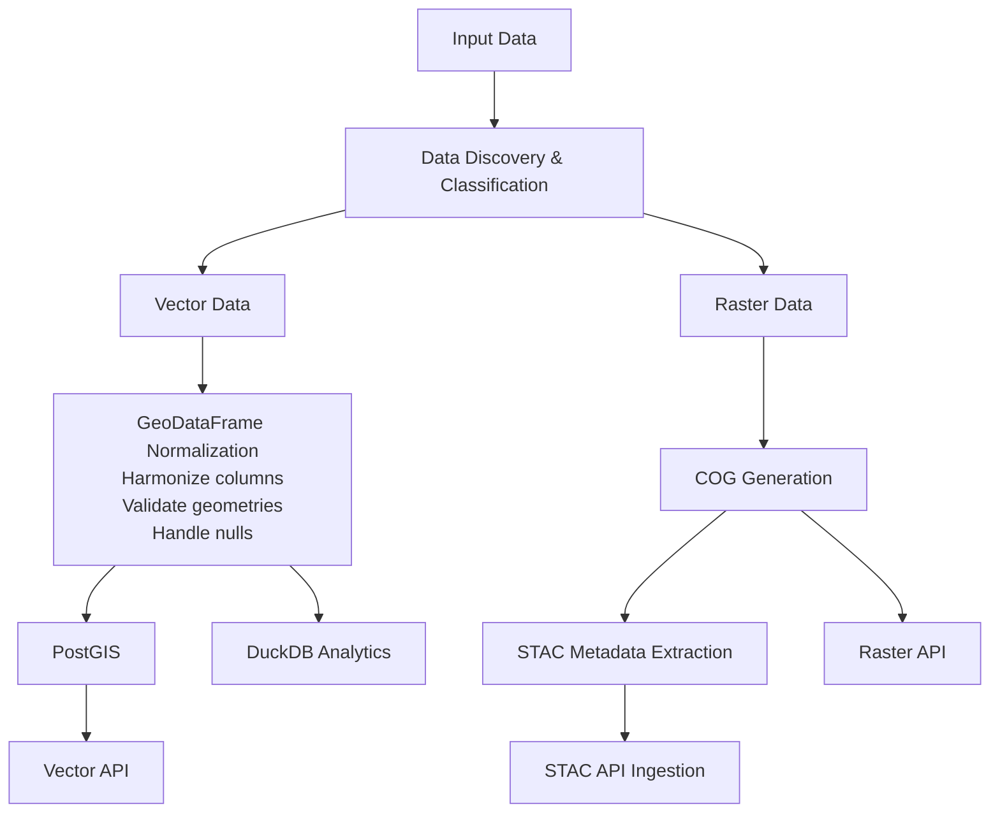

# GIS Pipeline

A geospatial data processing system that automates the extraction, transformation, and publication of GIS data into a distributed API ecosystem.

---

## Overview

The **gis-pipeline** ingests diverse geospatial data (shapefiles, GeoJSON, GeoPackages, geodatabases, CSVs, GeoTIFFs) and automatically:
- Discovers and classifies data by type
- Harmonizes CRS to a global standard (EPSG:4326 by default)
- Validates and normalizes geometries and attributes
- Ingests into PostGIS (vectors) and generates COGs (rasters)
- Creates STAC-compliant metadata
- Publishes to multiple APIs (STAC, PyGeoAPI, Vector/Raster APIs)

**Key Features:**
- **Multi-format support**: `.shp`, `.geojson`, `.gpkg`, `.gdb`, `.csv`, `.tif`/`.tiff`
- **Automatic discovery**: Recursively scans input directories
- **CRS harmonization**: Reprojects all data to a target CRS
- **Dual storage**: PostGIS for spatial queries + DuckDB for analytics
- **STAC compliance**: Full metadata generation for rasters
- **CSV intelligence**: Distinguishes spatial vs. non-spatial CSVs
- **Idempotent**: Safe to re-run on the same data

---

## Architecture



**[Full Technical Documentation](docs/TECHNICAL_DOCUMENTATION.md)**

---

## Quick Start

### Running the Pipeline

```bash
# Run with defaults (config.yaml settings)
docker compose exec gis-pipeline python3 -m gis_pipeline.main
```
```bash
# Override CRS and collection ID
docker compose exec gis-pipeline python3 -m gis_pipeline.main \
    --crs 32198 \
    --collection my_collection
```
```bash
# Custom input path
docker compose exec gis-pipeline python3 -m gis_pipeline.main \
    --input /data/custom_input
```

### Command-Line Arguments

See [ARGS.md](docs/ARGS.md) for full argument reference (auto-generated from code).

---

## Configuration

Pipeline settings are managed via **`config.yaml`** with environment variable overrides.

---

## Data Flow

### Vector Pipeline
1. **Discover** → Scan input for vectors (`.shp`, `.geojson`, `.csv`, etc.)
2. **Transform** → Validate, normalize columns, reproject
3. **Ingest** → PostGIS (spatial) or DuckDB Parquet (non-spatial)

### Raster Pipeline
1. **Discover** → Scan input for rasters (`.tif`, `.tiff`)
2. **Generate COG** → Reproject, optimize, store
3. **Extract Metadata** → Parse aux.xml, datetime tags
4. **Create STAC** → Build collection/items, validate

---

## Output

After running the pipeline, you'll see:

```
PROCESSING REPORT SUMMARY
----------------------------------------------------------
1. Vector data:
    Processed                : 5
    Errors                   : 0
    Skipped                  : 0
    Non_spatial_csv          : 2
----------------------------------------------------------
2. Raster data:
    Processed                : 3
    Errors                   : 0
    Skipped                  : 0
----------------------------------------------------------
```

**Generated artifacts:**
- PostGIS tables
- DuckDB Parquet files
- Cloud-Optimized GeoTIFFs (in `/data/output/raster_cog`)
- STAC collections/items (in STAC API)
- API endpoints (Vector, Raster, PyGeoAPI)

---

## Testing

```bash
# Run all tests
docker compose run --rm tests
```
```bash
# Run specific module tests
docker compose run --rm tests pytest gis-pipeline/test/modules/db/
```
```bash
# With coverage
docker compose run --rm tests pytest --cov=gis_pipeline
```

---


## Documentation

- **[Technical Documentation](docs/TECHNICAL_DOCUMENTATION.md)**
- **[CLI Arguments Reference](docs/ARGS.md)**

