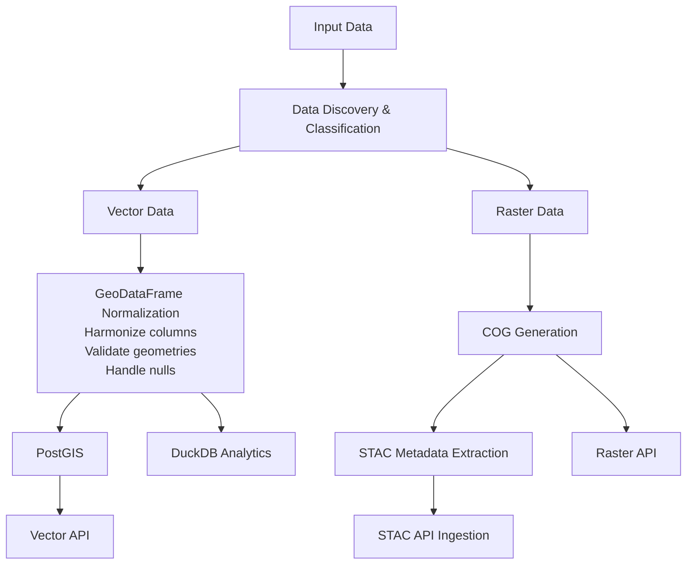
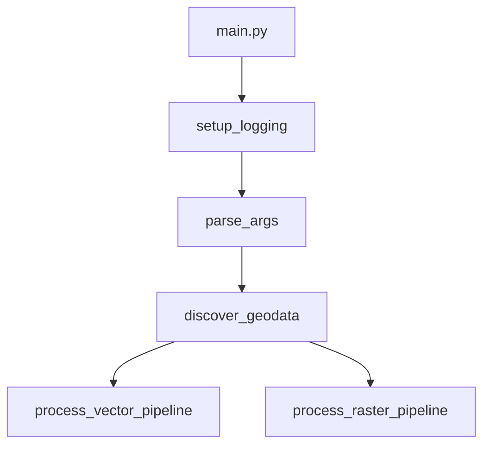
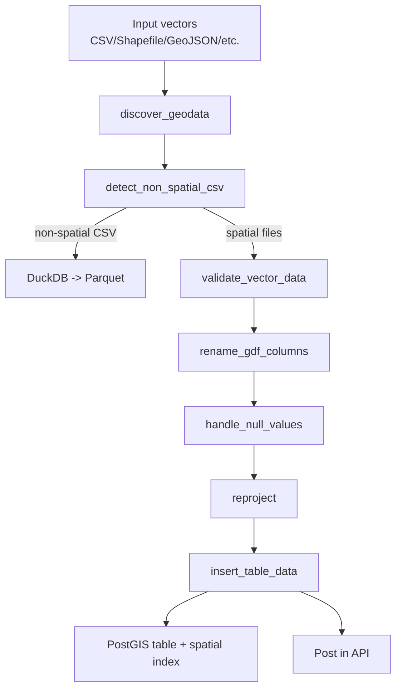
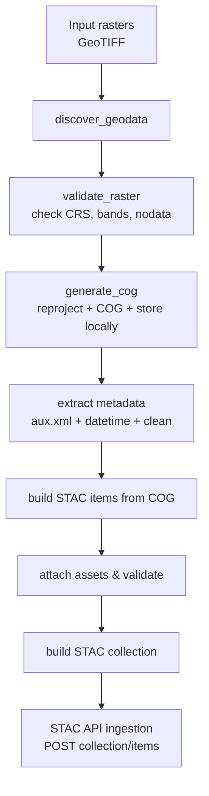

# GIS Pipeline - Architecture

---

## Table of Contents

1. [Overview](#overview)
2. [Architecture](#architecture)
3. [Core Components](#core-components)
4. [Module Structure](#module-structure)
5. [Data Flow](#data-flow)
6. [Database Integration](#database-integration)
7. [Testing Strategy](#testing-strategy)
8. [Extending the Pipeline](#extending-the-pipeline)
9. [Future Improvements](#future-improvements)
10. [Troubleshooting](#troubleshooting)

---

## Overview

### Purpose

The **gis-pipeline** is a geospatial data processing system designed to automate the extraction, transformation, and publication of GIS data into a distributed API ecosystem. It provides an automated, reproducible pipeline for handling multiple data types (vector and raster) while enforcing consistent standards and metadata enrichment.

### Key Features

- **Multi-format Support**: Handles shapefiles, GeoJSON, GeoPackages, geodatabases, CSVs, and GeoTIFFs
- **Automatic Data Discovery**: Recursively scans input directories for geospatial data
- **CRS Harmonization**: Reprojects all data to a global CRS (default: EPSG:4326)
- **Dual Database Backend**: PostGIS for structured spatial data + DuckDB for analytical workloads
- **STAC Compliance**: Generates STAC Collections and Items for raster data with complete metadata
- **CSV Intelligence**: Distinguishes spatial vs. non-spatial CSV files with automatic routing
- **Metadata Enrichment**: Extracts and normalizes metadata from multiple sources
- **API Integration**: Publishes results to STAC API, PyGeoAPI, Raster API, and Vector API

---

## Architecture

### High-Level Design



---

## Core Components

- **main.py**: Orchestrates the run—sets up logging, parses args, discovers data, then branches to vector and raster pipelines.
- **core/config.py**: Loads defaults from `config.yaml`, lets env vars override, exposes a `Config` class consumed across modules.
- **core/logging_setup.py**: Centralized structured logging + helpers like `handle_error` for consistent failures.
- **core/exceptions.py**: Thin layer for pipeline-specific exceptions.

### Execution Flow (high level)



---

## Module Structure

- **modules/io_tools**: `input_data.py` handles discovery of rasters/vectors and robust CSV loading with encoding/geometry detection.
- **modules/processing**: `geoprocessing.py` runs vector/raster workflows; `processing_stac.py` builds/ingests STAC collections/items.
- **modules/db**: `pg_utils.py` wraps PostGIS ingestion/indexing via SQLAlchemy; `duckdb_utils.py` manages DuckDB + spatial extension and Parquet export.
- **services/mapping.py**: Enums for supported formats, column aliases, null normalization, and type mappings used across the pipeline.

## Data Flow

### Vector Pipeline



### Raster Pipeline



---

## Database Integration

### PostGIS Strategy

**Purpose**: Structured vector data storage with spatial indexing.

**Key Features**:

- Geometry column with SRID constraint (e.g., EPSG:4326)
- Primary key (gid) for fast lookups
- JSONB column for flexible metadata
- Spatial index for neighbor queries
- Timestamp tracking (datetime column)

**Table Schema Example**:

```sql
CREATE TABLE my_dataset (
    gid INTEGER PRIMARY KEY,
    geometry geometry(Geometry, 4326) NOT NULL,
    datetime TIMESTAMP WITH TIME ZONE,
    metadata JSONB,
    other_attributes TEXT,
    ...
);

CREATE INDEX idx_my_dataset_geometry ON my_dataset USING GIST(geometry);
```

**Connection Pattern**:

```python
with PostGISManager() as pm:
    pm.insert_table_data(gdf, "my_dataset")
    # Automatic cleanup on exit
```

### DuckDB Strategy

**Purpose**: Analytical queries on non-spatial and spatial data.

**Key Features**:

- Parquet-based columnar storage
- Spatial extension for geometry operations
- No schema enforcement (flexible)
- Multi-file querying capability
- Faster-than-SQL analytics

**File Organization**:

```text
/data/duckdb/
├── eoapi.duckdb              # Main DuckDB database
├── duckdb_extensions/        # Extension directory
└── parquet_data/
    ├── non_spatial_dataset1.parquet
    ├── non_spatial_dataset2.parquet
    └── centroid_data.parquet
```

---

## Testing Strategy

### Test Structure

```text
test/
├── modules/
│   ├── db/               # Database utilities tests
│   ├── io_tools/         # Input/output tests
│   └── processing/       # Geoprocessing logic tests
└── conftest.py           # Fixtures and setup
```

### Testing Approach

1. **Unit Tests**: Individual functions with mocked dependencies
2. **Integration Tests**: Full pipeline with Docker services
3. **Fixture-Based**: Shared test data and database setup

### CI/CD Integration

- **pytest** with `--cov` for coverage reporting
- **Docker Compose** for isolated test environment
- **conftest.py** manages service setup/teardown

---

## Extending the Pipeline

### Adding New Data Types

**Example: Adding support for `.xyz` raster format**

1. Update `SupportedRasterFormats` enum:

   ```python
   class SupportedRasterFormats(Enum):
       TIF = ".tif"
       TIFF = ".tiff"
       XYZ = ".xyz"  # New format
   ```

2. Implement reading logic:

   ```python
   def read_xyz_raster(raster_path: Path) -> rasterio.DatasetReader:
       """Read XYZ raster format"""
       return rasterio.open(raster_path)
   ```

### Adding New Column Mappings

**Example: Adding support for `elevation` column alias**

```python
class ColumnMappings(Enum):
    ELEVATION = ColumnName(
        canonical="elevation",
        alias=["elev", "dem", "height", "altitude"]
    )
```

Now all variations are automatically normalized during processing.

---

## Future Improvements

### High-Priority Enhancements

1. **Async Processing for Large Datasets**
   - Current: Sequential processing of files
   - Proposed: Use `asyncio` or multiprocessing to parallelize vector/raster ingestion
   - Benefit: Significant speedup for bulk imports (potentially 3-5x faster)

2. **Incremental Updates**
   - Current: Full re-ingestion on every run
   - Proposed: Track file checksums/timestamps, skip unchanged files
   - Benefit: Faster re-runs, reduced database churn

3. **Streaming COG Generation**
   - Current: Load entire raster into memory for COG conversion
   - Proposed: Use GDAL streaming API for >2GB rasters
   - Benefit: Handle arbitrarily large rasters without OOM errors

4. **Enhanced Error Recovery**
   - Current: Pipeline stops on first critical error
   - Proposed: Implement retry logic with exponential backoff for transient failures
   - Benefit: More resilient to network/API timeouts

---

## Troubleshooting

### Common Issues

| Issue | Cause | Solution |
| ------- | ------- | ---------- |
| `PostGIS extension not enabled` | Database not configured | `CREATE EXTENSION postgis;` in PostgreSQL |
| `PROJ_LIB not found` | Projection database missing | Set env var: `PROJ_LIB=/usr/share/proj` |
| `CSV not recognized as spatial` | Missing lat/lon columns | Ensure columns match `ColumnMappings.LATITUDE/LONGITUDE` aliases |
| `Table name too long` | > 50 characters | Names auto-truncated and hashed (handled internally) |
| `Encoding errors reading CSV` | Non-UTF8 file | Pipeline tries UTF-8 then Latin-1 automatically |

---
