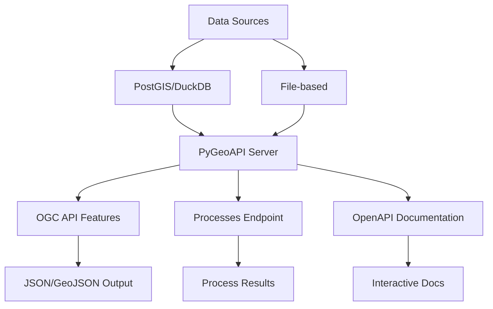

# PyGeoAPI

A standards-compliant OGC API for discovering, accessing, and processing geospatial feature data through REST endpoints and web services.

---

## Overview

**PyGeoAPI** is an OGC-compliant API server that provides:
- **Feature discovery & retrieval**: Query spatial datasets via OGC API Features
- **Custom processes**: Execute serverless geospatial operations
- **OpenAPI documentation**: Auto-generated API specifications
- **Multiple output formats**: JSON, GeoJSON, HTML, CSV
- **Flexible data sources**: PostGIS, DuckDB, file-based data

**Key Features:**
- OGC API Features (Part 1 & 2) compliance
- Process API for custom operations
- Configurable collections from multiple data sources
- Automatic OpenAPI/Swagger documentation
- RESTful data access with filtering and pagination

---

## Architecture



---

## Quick Start

### Running the API

```bash# Navigate to repository root
cd /path/to/mos-gis
# Full container stack
docker compose up --build
```

```bash
# PyGeoAPI only
docker compose up pygeoapi --build
```

Once running, access:
- **Collections**: http://localhost:5000/collections?f=html
- **Processes**: http://localhost:5000/processes?f=html
- **API Docs**: http://localhost:5000/openapi#/

---

## Configuration

The PyGeoAPI server is configured via the `config/pygeoapi-config.yaml` file. This YAML configuration:
- Defines data collections and their data sources
- Configures process endpoints
- Sets output formats and coordinate reference systems
- Automatically generates OpenAPI specifications

---

## Available Processes

### Process #1: hello-world-pygeoapi

A basic "Hello World" process demonstrating the OGC Processes API.

**Source**: [pygeoapi GitHub](https://github.com/geopython/pygeoapi/blob/master/pygeoapi/process/hello_world.py)

#### Usage Example

```bash
curl -X POST http://localhost:5000/processes/hello-world-pygeoapi/execution \
  -H "Content-Type: application/json" \
  -d '{
    "inputs": {
      "name": {
        "value": "Jérémie"
      }
    }
  }'
```

**Response:**
```json
{
  "id": "echo",
  "value": "Hello Jérémie!"
}
```

### Process #2: mycool-process

A custom process that takes CSV data and calculates derived values.

**Files:**
- Demo data: `processes/demo/obs.csv`
- Implementation: `processes/demo/mycool_process.py`

#### Usage Example

```bash
curl -X POST http://localhost:5000/processes/mycool-process/execution \
  -H "Content-Type: application/json" \
  -d '{}'
```

**Response:**
```json
{
  "id": "sqrt_values",
  "value": [
    {
      "id": 1,
      "value": 25,
      "sqrt": 5.0
    },
    {
      "id": 2,
      "value": 100,
      "sqrt": 10.0
    }
  ]
}
```

---

## API Endpoints

### Features API
- `GET /collections` - List all available collections
- `GET /collections/{collectionId}` - Get collection metadata
- `GET /collections/{collectionId}/items` - Query features in collection

### Processes API
- `GET /processes` - List available processes
- `GET /processes/{processId}` - Get process description
- `POST /processes/{processId}/execution` - Execute a process

### Documentation
- `GET /openapi` - Interactive OpenAPI/Swagger UI
- `GET /openapi.json` - Raw OpenAPI specification

---

## Development

### Adding a New Process

1. Create a Python class implementing the `BaseProcess` interface
2. Define inputs, outputs, and execution logic
3. Register in `config/pygeoapi-config.yaml`
4. Restart the server to load the new process

### Key Implementation Notes

- Processes are configured through the pygeoapi YAML configuration
- Each process must implement the OGC Processes API interface
- OpenAPI documentation is automatically generated from configuration
- Processes can be synchronous or asynchronous

---

## Documentation

- **[PyGeoAPI Official Documentation](https://docs.pygeoapi.io/)**
- **[OGC API Features](https://ogcapi.ogc.org/features/)**
- **[OGC API Processes](https://ogcapi.ogc.org/processes/)**

