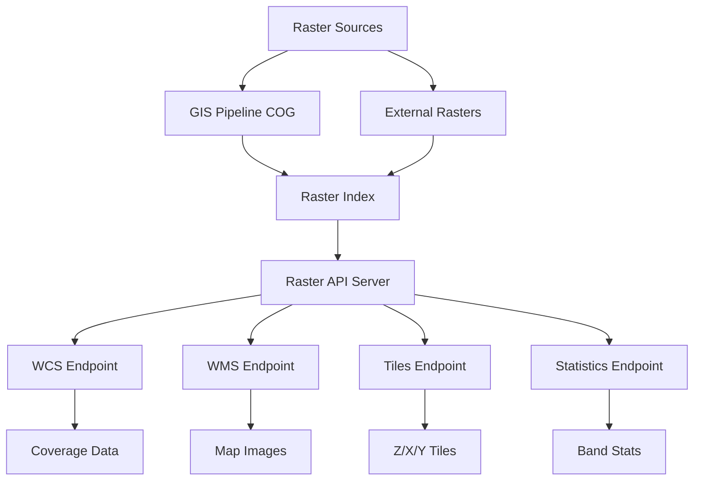

# Raster API

A high-performance REST API for accessing, querying, and processing Cloud-Optimized GeoTIFFs (COGs) and other raster imagery with support for dynamic mosaicking, reprojection, and band analysis.

---

## Overview

**Raster API** provides seamless access to geospatial raster data through standardized OGC endpoints. It enables:
- **COG serving**: Efficient access to Cloud-Optimized GeoTIFFs without downloading entire files
- **Tile generation**: On-the-fly tiling for web mapping applications
- **Band analysis**: Extract and compute statistics on individual bands
- **Reprojection**: Automatic CRS transformation
- **Mosaicking**: Combine multiple rasters into seamless coverages
- **Dynamic styling**: Apply color mapping and visualization rules

**Key Features:**
- **OGC WCS/WMS compliance**: Standard web coverage/map service protocols
- **COG optimization**: Leverages cloud-optimized raster structure
- **Efficient tiling**: Z/X/Y tile generation with caching
- **Band operations**: Extract, compute, and analyze individual bands
- **Geospatial subsetting**: Crop by bbox or geometry
- **Multiple formats**: GeoTIFF, PNG, JPEG, NetCDF output

---

## Architecture



---

## Quick Start

### Running the API

```bash
# Navigate to repository root
cd /path/to/mos-gis

# Full container stack
docker compose up --build
```

```bash
# Raster API only
docker compose up raster-api --build
```

Once running, access:
- **WCS Capabilities**: http://localhost:8082/wcs?service=WCS&version=2.0.1&request=GetCapabilities
- **Tiles**: http://localhost:8082/tiles/{dataset}/{z}/{x}/{y}
- **Statistics**: http://localhost:8082/statistics/{dataset}
- **API Docs**: http://localhost:8082/docs

---

## Configuration

The Raster API is configured via environment variables and configuration files in `config/`. Key settings include:
- Raster data paths and indexing
- Available coverages and datasets
- Tile cache settings
- Default output formats and CRS
- Band descriptions and styling rules

---

## Core Endpoints

### Web Coverage Service (WCS)
- `GET /wcs` - WCS endpoint with GetCapabilities, GetCoverage, DescribeCoverage requests
- Supports WCS 2.0.1 standard
- Returns GeoTIFF, NetCDF, and other formats

### Web Map Service (WMS)
- `GET /wms` - WMS endpoint with GetMap, GetCapabilities, GetFeatureInfo requests
- Supports WMS 1.3.0 standard
- Returns PNG, JPEG, or GeoTIFF map images

### Tile Endpoints
- `GET /tiles/{dataset}/{z}/{x}/{y}.png` - Web Mercator tiles
- `GET /tiles/{dataset}/{z}/{x}/{y}@2x.png` - High-DPI tiles
- `GET /tiles/{dataset}/tilejson.json` - TileJSON metadata

### Data Access
- `GET /data/{dataset}` - Dataset metadata
- `GET /data/{dataset}/preview` - Quick preview image
- `GET /data/{dataset}/bounds` - Spatial bounds

### Analytics
- `GET /statistics/{dataset}` - Band statistics (min, max, mean, stddev)
- `POST /statistics` - Compute stats for custom area
- `GET /histogram/{dataset}` - Band histograms

---

## Usage Examples

### Get Coverage Data (WCS)

```bash
curl -X GET "http://localhost:8082/wcs?service=WCS&version=2.0.1&request=GetCoverage&coverageId=sentinel-2&format=image/tiff" \
  -o coverage.tif
```

### Get Map Image (WMS)

```bash
curl -X GET "http://localhost:8082/wms?service=WMS&version=1.3.0&request=GetMap&layers=sentinel-2&bbox=45,-75,46,-74&width=800&height=600&crs=EPSG:4326&format=image/png" \
  -o map.png
```

### Get Tile

```bash
curl -X GET "http://localhost:8082/tiles/sentinel-2/10/305/255.png" \
  -o tile.png
```

### Get Band Statistics

```bash
curl -X GET "http://localhost:8082/statistics/sentinel-2" \
  | jq .
```

**Response:**
```json
{
  "bands": [
    {
      "band": 1,
      "name": "B2 - Blue",
      "min": 0,
      "max": 10000,
      "mean": 2500,
      "stddev": 1200,
      "nodata": 0
    },
    {
      "band": 2,
      "name": "B3 - Green",
      "min": 0,
      "max": 10000,
      "mean": 2800,
      "stddev": 1300,
      "nodata": 0
    }
  ]
}
```

---

## Supported Raster Formats

### Input Formats
- **Cloud-Optimized GeoTIFFs (COGs)**: Preferred format
- **GeoTIFFs**: Standard multi-band rasters
- **NetCDF**: Scientific raster data
- **JP2**: JPEG2000 imagery

### Output Formats
- GeoTIFF (default)
- PNG (with optional color mapping)
- JPEG (compressed imagery)
- NetCDF (scientific output)
- WebP (efficient web delivery)

---

## Band Operations

### RGB Composites

Create custom RGB composites by specifying band indices:

```bash
curl -X GET "http://localhost:8082/wms?service=WMS&version=1.3.0&request=GetMap&layers=sentinel-2&styles=true_color&bbox=45,-75,46,-74&width=800&height=600&format=image/png"
```

### Band Math

Compute derived indices (NDVI, etc.):

```bash
curl -X POST "http://localhost:8082/analytics/band-math" \
  -H "Content-Type: application/json" \
  -d '{
    "dataset": "sentinel-2",
    "expression": "(B8 - B4) / (B8 + B4)",
    "bbox": [45, -75, 46, -74]
  }'
```

---

## Development

### Adding a New Raster Dataset

1. Place COGs in `data/input/raster/`
2. Run gis-pipeline to index and optimize
3. Restart Raster API to load new dataset
4. Access via `/data/{dataset}` endpoints

### Custom Styling

Define color maps and styling in configuration:

```yaml
datasets:
  sentinel-2:
    styles:
      ndvi:
        expression: "(B8 - B4) / (B8 + B4)"
        colormap:
          - [0, 0, 0, 255]           # Black for negative values
          - [0.3, 255, 0, 0]         # Red
          - [0.6, 255, 255, 0]       # Yellow
          - [1.0, 0, 255, 0]         # Green
```

---

## Performance Optimization

### Tile Caching

The API implements multi-level caching:
- **In-memory cache**: Recent tiles (1 hour TTL)
- **Disk cache**: All tiles (7 days TTL)
- **CDN cache**: Static tiles (30 days)

### Efficient COG Access

Leverage COG internal tiling:
- Requests only download required blocks
- No need for full file download
- Streaming response capability

### Band Subsetting

Select only needed bands to reduce data transfer:

```bash
curl "http://localhost:8082/wcs?...&RangeSubset=B4,B3,B2"
```

---

## Testing

```bash
# Run all tests
docker compose run --rm tests

# Run Raster API specific tests
docker compose run --rm tests pytest raster-api/test/

# With coverage report
docker compose run --rm tests pytest --cov=raster_api raster-api/test/
```

---

## Documentation

- **[OGC Web Coverage Service](https://www.ogc.org/standards/wcs)**
- **[OGC Web Map Service](https://www.ogc.org/standards/wms)**
- **[Cloud-Optimized GeoTIFF](https://www.cogeo.org/)**
- **[eoAPI Raster Demo](https://raster.eoapi.dev/)**
