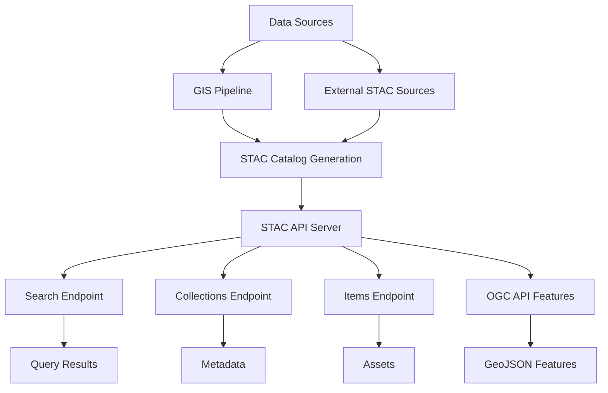

# STAC API

A standards-compliant SpatioTemporal Asset Catalog (STAC) API for discovering, browsing, and accessing geospatial imagery (raster data) and related assets through REST endpoints.

---

## Overview

**STAC API** provides a standardized way to search, discover, and access geospatial metadata and imagery. It implements the full STAC specification including:
- **Catalog discovery**: Browse STAC collections and items hierarchically
- **Advanced search**: Query by spatial extent, temporal range, and metadata properties
- **Asset access**: Retrieve imagery, metadata, and related files
- **OGC compliance**: Implements OGC API Features and STAC API specifications
- **Metadata harvesting**: Automatic integration with external data sources

**Key Features:**
- Full STAC API (v1.0.0) compliance
- OGC API Features integration
- Spatial and temporal filtering
- Flexible asset management
- RESTful endpoint discovery
- Extensible metadata schema

---

## Architecture



---

## Quick Start

### Running the API

```bash
# Navigate to repository root
cd /path/to/mos-gis

# Full container stack
docker compose up --build
```

```bash
# STAC API only
docker compose up stac-api --build
```

Once running, access:
- **STAC Catalog**: http://localhost:8081/
- **Collections**: http://localhost:8081/collections
- **Search**: http://localhost:8081/search
- **API Docs**: http://localhost:8081/api.html

---

## Configuration

The STAC API is configured via environment variables and the `config/` directory. Key configuration includes:
- Database connection settings (PostgreSQL, DuckDB)
- STAC catalog metadata (title, description, license)
- Available collections and asset paths
- CORS and authentication policies

---

## Core Endpoints

### Collections Endpoint
- `GET /` - STAC Catalog root
- `GET /collections` - List all collections
- `GET /collections/{collectionId}` - Get collection metadata

### Items Endpoint
- `GET /collections/{collectionId}/items` - Browse items in collection
- `GET /collections/{collectionId}/items/{itemId}` - Get item metadata
- `GET /collections/{collectionId}/items/{itemId}/assets/{assetId}` - Access individual assets

### Search Endpoint
- `GET /search` - Simple keyword search
- `POST /search` - Advanced search with filters
  - Spatial filtering (bbox, intersects)
  - Temporal filtering (datetime range)
  - Property-based filtering

### OGC API Features
- Implements OGC API Features specification
- GeoJSON response format
- Feature filtering and pagination
- Standards-compliant endpoints

### Documentation
- `GET /api.html` - Interactive Swagger UI
- `GET /openapi.json` - Raw OpenAPI specification

---

## Search Examples

### Basic Search by Bounding Box

```bash
curl -X POST http://localhost:8081/search \
  -H "Content-Type: application/json" \
  -d '{
    "bbox": [-75.0, 45.0, -74.0, 46.0],
    "limit": 10
  }'
```

### Search by Date Range and Collection

```bash
curl -X POST http://localhost:8081/search \
  -H "Content-Type: application/json" \
  -d '{
    "collections": ["sentinel-2"],
    "datetime": "2023-01-01T00:00:00Z/2023-12-31T23:59:59Z",
    "limit": 50
  }'
```

### Advanced Filter Search

```bash
curl -X POST http://localhost:8081/search \
  -H "Content-Type: application/json" \
  -d '{
    "bbox": [-75.0, 45.0, -74.0, 46.0],
    "datetime": "2023-06-01T00:00:00Z/2023-08-31T23:59:59Z",
    "filter": {
      "op": "and",
      "args": [
        {"op": "<=", "args": [{"property": "eo:cloud_cover"}, 20]},
        {"op": "==", "args": [{"property": "platform"}, "sentinel-2"]}
      ]
    }
  }'
```

---

## Data Integration

### From GIS Pipeline

The STAC API automatically indexes:
- Raster COGs generated by the gis-pipeline
- STAC metadata from the gis-pipeline output
- DuckDB analytics tables
- Vector layer metadata

### Adding External STAC Sources

Configure external STAC sources in the application settings:

```yaml
external_stac_sources:
  - url: https://example.com/stac/catalog.json
    name: external-catalog
    sync_interval: 86400  # seconds
```

---

## Development

### Adding a New Collection

1. Create collection metadata in `config/collections/`
2. Prepare asset data (GeoTIFFs, COGs, etc.)
3. Run STAC ingestion process
4. Verify through `/collections` endpoint

### Extending Metadata

The STAC API supports custom extensions:
- EO (Electro-Optical Imagery)
- SAR (Synthetic Aperture Radar)
- Projection (CRS Information)
- Raster (Band Descriptions)
- Custom extensions

---

## Testing

```bash
# Run all tests
docker compose run --rm tests

# Run STAC API specific tests
docker compose run --rm tests pytest stac-api/test/

# With coverage report
docker compose run --rm tests pytest --cov=stac_api stac-api/test/
```

---

## Documentation

- **[STAC Specification](https://stacspec.org/)**
- **[STAC API Documentation](https://github.com/stac-api/stac-api-spec)**
- **[OGC API Features](https://ogcapi.ogc.org/features/)**

---

## Performance Optimization

### Indexing

The API automatically creates database indexes on:
- Collection IDs
- Asset types
- Temporal ranges
- Spatial bounds

### Caching

Implemented caching strategies:
- Collection metadata caching
- Search results caching
- Asset listing caching

