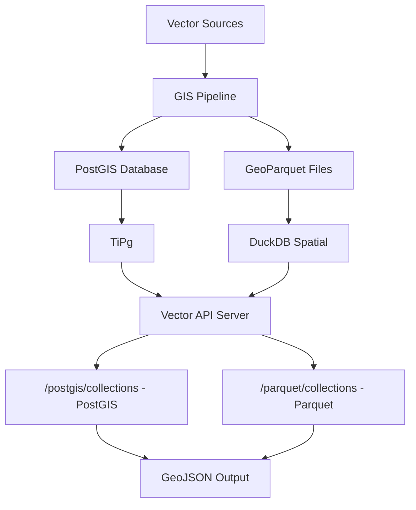

# Vector API

A high-performance REST API for accessing and querying geospatial vector features (points, lines, polygons) with support for spatial filtering, attribute queries, and real-time feature discovery.

---

## Overview

**Vector API** provides seamless access to geospatial vector data through standardized OGC endpoints. It supports two data sources:

| Source | Endpoint Prefix | Description |
|--------|-----------------|-------------|
| **PostGIS** | `/postgis/collections` | Traditional database-backed collections via TiPg |
| **GeoParquet** | `/parquet/collections` | File-based collections with auto-discovery |

**Key Features:**
- **OGC API Features compliance**: Standard vector web service protocol
- **Dual data sources**: PostGIS tables + GeoParquet files
- **Auto-discovery**: New Parquet files automatically exposed
- **Spatial queries**: Filter features by location (bbox, intersects)
- **Multiple formats**: GeoJSON output (PostGIS/TiPg endpoint supports additional formats via `?f=`)
- **Pagination support**: Large dataset browsing
- **DuckDB spatial**: High-performance Parquet queries

---

## Architecture



---

## Quick Start

### Running the API

```bash
# Navigate to repository root
cd /path/to/mos-gis

# Full container stack
docker compose up --build
```

```bash
# Vector API only
docker compose up vector-api --build
```

Once running, access:
- **Root Landing**: http://localhost:8083/
- **PostGIS Collections**: http://localhost:8083/postgis/collections
- **Parquet Collections**: http://localhost:8083/parquet/collections
- **API Docs**: http://localhost:8083/api.html

---

## Core Endpoints

### PostGIS Collections (TiPg)

| Endpoint | Description |
|----------|-------------|
| `GET /postgis/collections` | List all PostGIS collections (auto-discovered) |
| `GET /postgis/collections/{id}` | Collection metadata |
| `GET /postgis/collections/{id}/items` | Query features |
| `GET /postgis/collections/{id}/items/{featureId}` | Single feature by ID |
| `GET /postgis/collections/{id}/queryables` | Queryable properties |

### GeoParquet Collections (DuckDB)

| Endpoint | Description |
|----------|-------------|
| `GET /parquet/collections` | List all Parquet collections (auto-discovered) |
| `GET /parquet/collections/{id}` | Collection metadata (e.g. schema, bbox, count) |
| `GET /parquet/collections/{id}/items` | Query features with `limit`, `offset`, `bbox` |
| `GET /parquet/collections/{id}/items/{itemId}` | Single feature by ID |
| `GET /parquet/collections/{id}/queryables` |Queryable properties |

---

## Usage Examples

### PostGIS vs Parquet - Same Data, Different Sources

The same dataset can be queried from both sources:

```bash
# PostGIS (database table)
curl "http://localhost:8083/postgis/collections/public.couverture_pedo_2022/items?limit=5"

# GeoParquet (file-based)
curl "http://localhost:8083/parquet/collections/couverture_pedo_2022/items?limit=5"
```

### List Parquet Collections

```bash
curl -X GET "http://localhost:8083/parquet/collections" \
  -H "Accept: application/json"
```

**Response:**
```json
{
  "collections": [
    {
      "id": "couverture_pedo_2022",
      "title": "Couverture Pedo 2022",
      "description": "GeoParquet collection: couverture_pedo_2022",
      "extent": {
        "spatial": {
          "bbox": [[-79.5, 45.0, -57.0, 62.0]],
          "crs": "http://www.opengis.net/def/crs/OGC/1.3/CRS84"
        }
      },
      "itemType": "feature"
    }
  ],
  "numberMatched": 1,
  "numberReturned": 1
}
```

### Query Parquet Items with Bbox Filter

```bash
curl "http://localhost:8083/parquet/collections/couverture_pedo_2022/items?bbox=-73.6,45.4,-73.4,45.6&limit=10"
```

**Response:**
```json
{
  "type": "FeatureCollection",
  "features": [
    {
      "type": "Feature",
      "id": 1,
      "geometry": {
        "type": "Polygon",
        "coordinates": [[[-73.5, 45.5], [-73.4, 45.5], [-73.4, 45.6], [-73.5, 45.6], [-73.5, 45.5]]]
      },
      "properties": {
        "gid": 1,
        "app_cart": "EAU",
        "description": "Étendue d'eau(EAU)",
        "superf_ha": 0.0968
      }
    }
  ],
  "numberMatched": 150,
  "numberReturned": 10,
  "links": [
    {"rel": "next", "href": ".../items?limit=10&offset=10"}
  ]
}
```

### Get Single Parquet Item

```bash
curl "http://localhost:8083/parquet/collections/couverture_pedo_2022/items/1"
```

---

## Configuration

The Vector API is configured via environment variables and configuration files in `config/`. Key settings include:
- PostGIS connection parameters
- Available feature collections
- Output format defaults
- CRS transformation settings
- API authentication and CORS policies

### Parquet Configuration

| Variable | Default | Description |
|----------|---------|-------------|
| `DUCKDB_DATA_DIR` | `/data/duckdb` | Directory scanned for `.parquet` files |

---

## PostGIS Endpoints

### Collections Endpoint
- `GET /postgis/collections` - List all available feature collections
- `GET /postgis/collections/{collectionId}` - Get collection metadata

### Features Endpoint (Items)
- `GET /postgis/collections/{collectionId}/items` - Query features in collection with filters
- `GET /postgis/collections/{collectionId}/items/{featureId}` - Get single feature

### OGC API Features
- Bounding box filtering: `?bbox=minx,miny,maxx,maxy`
- CRS specification: `?crs=EPSG:4326`
- Limit and offset pagination: `?limit=100&offset=0`
- Implements OGC API Features specification

### Advanced Search
- CQL (Common Query Language) filtering
- Property-based queries
- Spatial operators (intersects, within, contains)
- Temporal filtering

### Output Formats (PostGIS/TiPg only)
- `?f=json` - GeoJSON (default)

### Documentation Endpoint
- `GET /docs` - Interactive Swagger UI
- `GET /openapi.json` - Raw OpenAPI specification
- `GET /api` - API landing page

---

## Usage Examples

### List Collections

```bash
curl -X GET "http://localhost:8083/postgis/collections" \
  -H "Accept: application/json"
```

**Response:**
```json
{
  "collections": [
    {
      "id": "municipalities",
      "title": "Municipal Boundaries",
      "description": "Administrative boundaries for municipalities",
      "extent": {
        "spatial": {
          "bbox": [[-75.0, 45.0, -74.0, 46.0]]
        },
        "temporal": {
          "interval": [["2020-01-01T00:00:00Z", null]]
        }
      }
    }
  ]
}
```

### Query Features by Bounding Box

```bash
curl -X GET "http://localhost:8083/postgis/collections/municipalities/items?bbox=-75,-75.5,45,45.5&limit=10"
```

### Advanced Feature Query with CQL Filter (PostGIS only)

> **Note:** CQL filtering is a TiPg/PostGIS feature. It is not supported by the Parquet (`/parquet/collections`) endpoints, which only accept `limit`, `offset`, and `bbox`.

```bash
curl -X POST "http://localhost:8083/postgis/collections/municipalities/items" \
  -H "Content-Type: application/json" \
  -d '{
    "filter": {
      "op": "and",
      "args": [
        {"op": ">", "args": [{"property": "population"}, 50000]},
        {"op": "s_intersects", "args": [{"property": "geometry"}, {"bbox": [-75, 45, -74, 46]}]}
      ]
    },
    "limit": 50
  }'
```

---

## Spatial Operations

### Spatial Filtering

Query features that intersect with a geometry:

```bash
curl -X POST "http://localhost:8083/postgis/collections/parcels/items" \
  -H "Content-Type: application/json" \
  -d '{
    "filter": {
      "op": "s_intersects",
      "args": [
        {"property": "geometry"},
        {
          "type": "Polygon",
          "coordinates": [[[-75, 45], [-74, 45], [-74, 46], [-75, 46], [-75, 45]]]
        }
      ]
    }
  }'
```

---

## Attribute Filtering

Query features by property values:

```bash
# Features with population > 100,000
curl "http://localhost:8083/postgis/collections/municipalities/items?filter=population%3E100000"

# Multiple conditions (AND)
curl "http://localhost:8083/postgis/collections/municipalities/items?filter=population%3E50000%20AND%20province%3DQC"

# Date range
curl "http://localhost:8083/postgis/collections/events/items?filter=date%3E%272023-01-01%27%20AND%20date%3C%272023-12-31%27"
```

---

## Output Formats

### GeoJSON
Standard GeoJSON output for web mapping applications:

```json
{
  "type": "FeatureCollection",
  "features": [
    {
      "type": "Feature",
      "id": "municipalities.123",
      "geometry": {
        "type": "Polygon",
        "coordinates": [[[-75, 45], [-74, 45], [-74, 46], [-75, 46], [-75, 45]]]
      },
      "properties": {
        "name": "Montreal",
        "population": 1704694,
        "province": "QC"
      }
    }
  ]
}
```

---

## Development

### Adding a New Collection

#### PostGIS (via GIS Pipeline)
1. Ingest vector data through gis-pipeline
2. Data automatically registers in PostGIS
3. Vector API discovers and indexes new collection
4. Access via `/postgis/collections/{newCollectionId}/items`

#### GeoParquet (Auto-Discovery)
1. Place `.parquet` file in `data/duckdb/` directory
2. File is **automatically discovered** on next API request
3. Access via `/parquet/collections/{filename}/items`
4. No restart or configuration needed!

```bash
# Example: Add new GeoParquet
cp my_new_dataset.parquet data/duckdb/

# Immediately available at:
curl "http://localhost:8083/parquet/collections/my_new_dataset/items"
```

### Custom Attribute Indexes

Create indexes for efficient queries:

```sql
-- In PostGIS configuration
CREATE INDEX idx_municipalities_population 
  ON municipalities (population);

CREATE INDEX idx_municipalities_geometry 
  USING GIST (geometry);
```

---

## Performance Optimization

### Spatial Indexing

PostGIS automatically creates GIST indices for:
- Geometry columns
- Frequently filtered properties
- Temporal columns

### Pagination

Use limit and offset for large result sets:

```bash
# First page (100 features)
curl "http://localhost:8083/postgis/collections/municipalities/items?limit=100&offset=0"

# Second page
curl "http://localhost:8083/postgis/collections/municipalities/items?limit=100&offset=100"
```

### Caching

API response caching based on:
- Collection metadata (24 hour TTL)
- Feature queries (5 minute TTL based on filter)
- Bounding box results (1 hour TTL)

---

## Testing

```bash
# Run all tests
docker compose run --rm tests

# Run Vector API specific tests
docker compose run --rm tests pytest vector-api/test/

# With coverage report
docker compose run --rm tests pytest --cov=vector_api vector-api/test/
```

---

## Documentation

- **[OGC API Features](https://ogcapi.ogc.org/features/)**
- **[PostGIS Documentation](https://postgis.net/documentation/)**
- **[GeoParquet Specification](https://geoparquet.org/)**
- **[DuckDB Spatial Extension](https://duckdb.org/docs/extensions/spatial.html)**
- **[TiPg Documentation](https://developmentseed.org/tipg/)**
